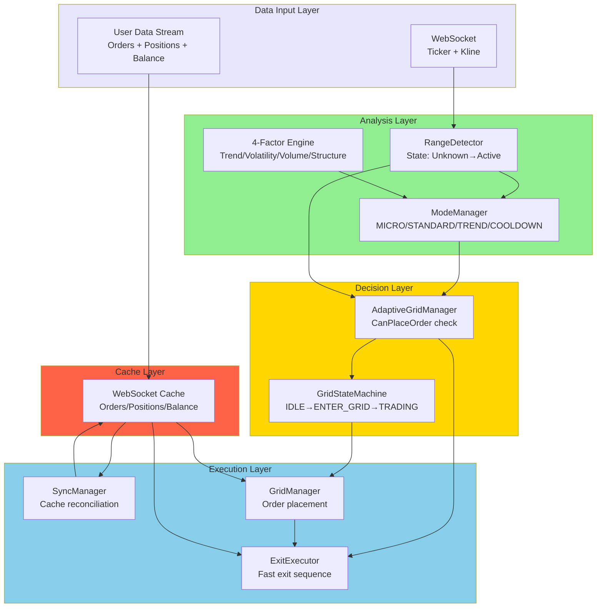
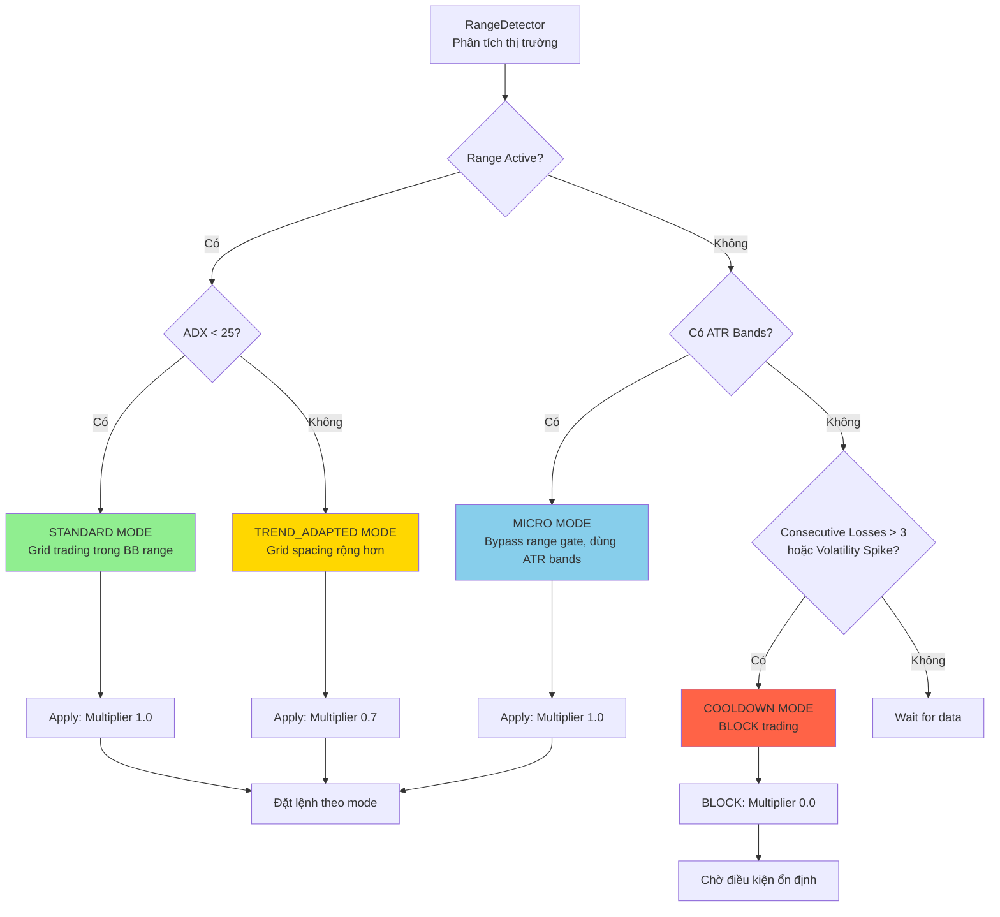
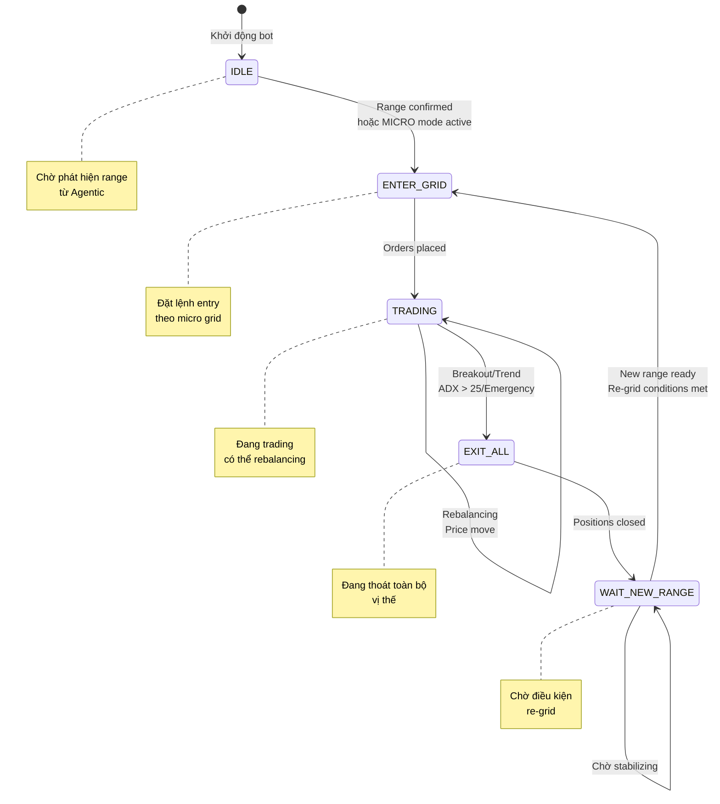
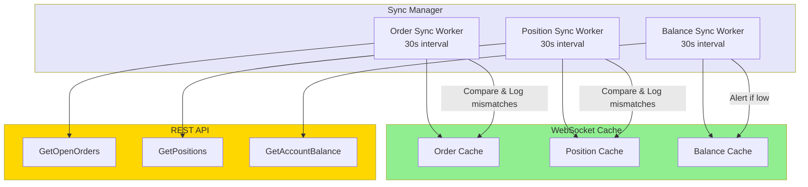
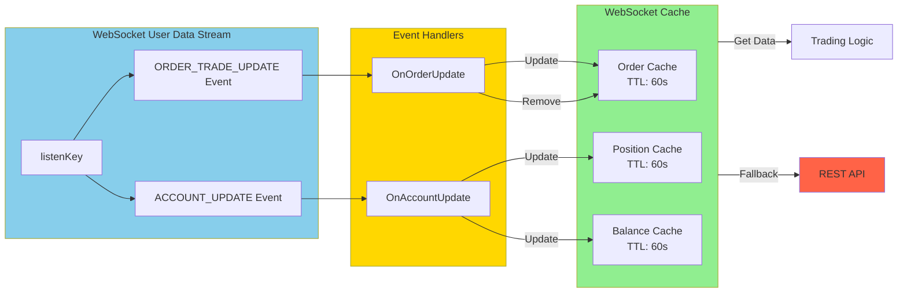

# AGENTIC TRADING - Nghiệp Vụ Vận Hành

## 1. Tổng Quan Hệ Thống

### 1.1 Định Nghĩa
Agentic Trading là hệ thống giao dịch thông minh tự động điều chỉnh chiến lược dựa trên phân tích thị trường theo thời gian thực. Hệ thống tự động nhận biết chế độ thị trường, tính toán điểm số đa yếu tố, điều chỉnh kích thước lệnh/grid spacing phù hợp, và sử dụng **trading modes** (MICRO, STANDARD, TREND_ADAPTED, COOLDOWN) để adaptive risk control.

**Tổng quan kiến trúc hệ thống:**



### 1.2 Trading Modes (Mới - Phase 2)

Hệ thống sử dụng **4 Trading Modes** để điều chỉnh chiến lược giao dịch:

| Mode | Điều Kiện Kích Hoạt | Chiến Lược | Sizing Multiplier |
|------|-------------------|-----------|-------------------|
| **MICRO** | Range not active, ATR bands available | Bypass strict range gate, dùng ATR bands | 1.0 |
| **STANDARD** | Range active, ADX < 25 | Grid trading trong BB range | 1.0 |
| **TREND_ADAPTED** | Range active, ADX > 25 | Grid với spacing rộng hơn | 0.7 |
| **COOLDOWN** | Consecutive losses > 3 hoặc volatility spike | **BLOCK** trading, chờ ổn định | 0.0 |

**ModeManager Flow:**



### 1.3 Các Chế Độ Thị Trường (Regime) & State Machine

Hệ thống sử dụng **Unified State Machine** với 5 states:



| State | Điều Kiện Vào | Cho Phép Đặt Lệnh | Mô Tả |
|-------|---------------|-------------------|-------|
| **IDLE** | Khởi động | ❌ | Chờ phát hiện range từ Agentic |
| **ENTER_GRID** | Range confirmed hoặc MICRO mode active | ✅ | Đặt lệnh entry theo micro grid |
| **TRADING** | Orders placed | ✅ | Đang trading, có thể rebalancing |
| **EXIT_ALL** | Breakout/Trend/ADX > 25/Emergency | ❌ | Đang thoát toàn bộ vị thế |
| **WAIT_NEW_RANGE** | Positions closed | ❌ | Chờ điều kiện regrid (shift ≥ 0.5%, BB contract) |

| Chế Độ Thị Trường | Đặc Điểm | Chiến Lược Grid |
|-------------------|----------|-----------------|
| **Sideways** | Giá dao động trong biên độ hẹp, ADX < 20 | Micro grid 0.05%, 5 orders/side, dynamic leverage cao |
| **Trending** | Xu hướng rõ ràng, ADX > 25 | TREND_ADAPTED mode, spacing rộng hơn |
| **Breakout** | Vượt BB bands | **EXIT ALL** - chờ stabilizing |
| **Stabilizing** | Sau breakout, chờ BB mới | Không trading |

**Lưu ý Quan Trọng:**
- **MICRO mode bypass**: Khi range not active, dùng ATR bands để bypass strict range gate
- ModeManager check trước khi placement → block nếu COOLDOWN
- Micro grid (0.05% spread) là **primary geometry**, BB chỉ dùng để gate permission
- Re-grid chỉ xảy ra sau khi qua WAIT_NEW_RANGE với điều kiện nghiêm ngặt

### 1.3 Điểm Số Triển Khai (0-100)

```
≥70 điểm (high_score): Triển khai full size (multiplier 1.0)
50-69 điểm (medium_score): Triển khai reduced size (multiplier 0.6)
35-49 điểm (low_score): Monitor only, giảm size (multiplier 0.3)
<35 điểm (skip_score): Chờ đợi, không triển khai
```

### 1.4 Whitelist Management (Enabled by Default)

| Tham Số | Giá Trị | Mô Tả |
|---------|---------|-------|
| Enabled | `true` | Tự động quản lý whitelist |
| Max Symbols | 5 | Số symbol tối đa trong whitelist |
| Min Score to Add | 60 | Ngưỡng điểm tối thiểu để thêm symbol |
| Universe | BTCUSD1, ETHUSD1, SOLUSD1 | Danh sách mặc định |

---

## 2. Quy Trình Khởi Động (Cold Start)

### 2.1 Warm-up Phase
1. **Load dữ liệu lịch sử**: Hệ thống tự động tải 1000 nến gần nhất từ API
2. **Tính toán chỉ báo**: ADX, Bollinger Band, ATR, EMA (9, 21, 50, 200)
3. **Xác định chế độ**: Phân tích chỉ báo để xác định regime hiện tại
4. **Sẵn sàng giao dịch**: Chờ tích lũy đủ dữ liệu (không cần 2 lần đọc giống nhau)

### 2.2 Pattern Learning Phase
- **Giai đoạn 1 (0-200 trades)**: Chỉ thu thập dữ liệu, chưa dùng pattern
- **Giai đoạn 2 (≥200 trades + accuracy ≥60%)**: Pattern bắt đầu ảnh hưởng ±5 điểm vào score
- **Decay công thức**: Pattern cũ có trọng số giảm theo thời gian `exp(-days/14)`

---

## 3. Circuit Breakers - Cầu Chì An Toàn

### 3.1 5 Cầu Chì Tự Động (Đã Implement)

| Cầu Chì | Điều Kiện Kích Hoạt | Hành Động | Ưu Tiên |
|---------|---------------------|-----------|---------|
| **ADX Spike** | ADX > 25 (trend mạnh) | Exit all, transition EXIT_ALL | 1 |
| **BB Expansion** | BB width > 1.5% | Exit all, chờ contraction | 1 |
| **Breakout** | Giá ngoài BB 2+ candles | Cancel orders, close positions | 1 |
| **Consecutive Losses** | > 3 losses liên tiếp | Pause + 30s cooldown | 2 |
| **Multi-Layer Liquidation** | Tier 1-4 distance | Tier1: warn, Tier2: reduce 50%, Tier3: close all, Tier4: hedge+close | 3 |

**Real-time Exit Monitor:**
- Goroutine riêng kiểm tra ADX/BB mỗi **100ms** (không phụ thuộc WebSocket)
- Thread-safe với mutex, idempotent (tránh duplicate exit)

> **Note**: State machine đảm bảo chỉ có 1 exit path duy nhất, không bị race condition

### 3.2 Reset Cầu Chì
- **Tự động**: Sau thời gian chờ (30s - 5 phút tùy cầu chì)
- **Thủ công**: Operator có thể reset qua API/command

---

## 4. ExitExecutor - Fast Exit Sequence (Mới - Phase 4)

### 4.1 Fast Exit Logic

ExitExecutor cung cấp chuỗi thoát nhanh khi breakout detected:


### 4.2 ExitExecutor Features

| Feature | Implementation |
|---------|----------------|
| **Cancel Orders** | Parallel cancellation với T+100ms timeout |
| **Close Positions** | Market orders cho tất cả positions |
| **Verify Closure** | Check WebSocket cache sau T+5s |
| **Retry Logic** | Tự động retry nếu position chưa closed |
| **Fallback** | Nếu ExitExecutor fail → dùng ExitAll() cũ |

**Wiring:**
- AdaptiveGridManager.handleBreakout() → ExitExecutor.ExecuteFastExit()
- Type assertion để gọi interface method (tránh circular dependency)

---

## 5. SyncManager - Cache Sync Workers (Mới - Phase 7)

### 5.1 Sync Workers Architecture

SyncManager điều phối 3 sync workers để reconcile internal cache với REST API:



### 5.2 Sync Worker Logic

| Worker | Interval | Logic | Fallback |
|--------|----------|-------|----------|
| **Order Sync** | 30s | Reconcile cache orders with REST API | Log mismatches |
| **Position Sync** | 30s | Reconcile cache positions with REST API | Log mismatches |
| **Balance Sync** | 30s | Reconcile cache balance with REST API | Alert if low |

**Cache Stale Detection:**
- IsCacheStale(cacheType) → check last update timestamp
- TTL: 60s cho orders, 60s cho positions, 60s cho balance
- Nếu stale → fallback to REST API

**Wiring:**
- VolumeFarmEngine.Start() → SyncManager.Start()
- VolumeFarmEngine.Stop() → SyncManager.Stop()

---

## 6. WebSocket Cache & Auto-Sync (Mới - Phase 6)

### 6.1 Cache Architecture

WebSocketClient có 3 cache structures với auto-sync từ user data stream:



### 6.2 Cache Methods

| Method | Mô Tả |
|--------|-------|
| `GetCachedOrders(symbol)` | Lấy orders từ cache |
| `GetCachedPositions()` | Lấy positions từ cache |
| `GetCachedBalance()` | Lấy balance từ cache |
| `UpdateOrderCache(order)` | Update order khi nhận event |
| `RemoveOrderCache(symbol, orderID)` | Xóa order khi filled/cancelled |
| `UpdatePositionCache(position)` | Update position khi nhận event |
| `UpdateBalanceCache(balance)` | Update balance khi nhận event |
| `IsCacheStale(cacheType)` | Check cache có stale không |
| `SubscribeToUserData(listenKey)` | Subscribe user data stream |

**Auto-Sync Flow:**
1. Create listenKey via REST API
2. Subscribe to user data WebSocket stream
3. Parse ACCOUNT_UPDATE → Update position/balance cache
4. Parse ORDER_TRADE_UPDATE → Update/remove order cache
5. Sync workers periodically reconcile with REST API

**Benefits:**
- Giảm REST API calls (chỉ dùng khi cache stale)
- Real-time updates từ WebSocket
- Fallback to REST API khi cần

---

## 7. Yếu Tố Tính Toán Điểm Số (4 Factors)

### 7.1 Trọng Số Các Yếu Tố

| Yếu Tố | Trọng Số | Ý Nghĩa |
|--------|----------|---------|
| **Trend** | 30% | Xu hướng thị trường (EMA alignment, ADX) |
| **Volatility** | 25% | Mức độ biến động (ATR, BB width) |
| **Volume** | 25% | Khối lượng giao dịch (vs MA20) |
| **Structure** | 20% | Cấu trúc giá (support/resistance) |

### 7.2 Hệ Số Điều Chỉnh Theo Chế Độ

```
Trending: Trend +20%, Volatility -10%
Sideways: Volatility +15%, Volume +10%
Volatile: Tất cả yếu tố bị giảm trọng số
Recovery: Dần dần trở về bình thường
```

---

## 8. Quản Lý Vị Thế

### 8.1 Công Thức Kích Thước Lệnh

```
final_size = base_size × score_multiplier × volatility_multiplier × leverage_multiplier

Trong đó:
- score_multiplier: 1.0 (≥75đ), 0.6 (60-74đ), 0.3 (<60đ)
- volatility_multiplier: 1.0 (normal), 0.5 (high), 0.0 (extreme)
- leverage_multiplier: Dynamic leverage theo BB width (inverse proportion)

Dynamic Leverage Formula:
- BB width 0.2% → 100x (tight range)
- BB width 0.5% → 80x (normal)
- BB width 1.0% → 40x (wide)
- BB width 2.0% → 20x (volatile, capped)
```

**T012: BB Period Unified = 10** (Cả Agentic và Execution dùng chung)

### 8.2 Grid Configuration (Micro Grid Priority)

**T003: Micro Grid là Primary Geometry** (Ưu tiên cao nhất)

| Tham Số | Giá Trị | Mô Tả |
|---------|---------|-------|
| Spread | **0.05%** (0.0005) | Khoảng cách giữa các lệnh |
| Orders/Side | **5** | Tổng 10 lệnh (5 buy + 5 sell) |
| Min Order | **$3** | Minimum order size USDT |
| BB Period | **10** | Fast detection (T012) |
| BB Multiplier | 2.0 | Standard deviation |
| ADX Threshold | 20 | Ngưỡng sideways vs trending |

**Fallback:** Nếu micro grid disabled → Dùng BB bands để tính grid geometry

---

## 9. Logging & Audit

### 9.1 Decision Log
Mỗi quyết định được ghi nhận:
- Timestamp
- Regime hiện tại + confidence
- 4 factors (giá trị + đóng góp)
- Final score + multipliers
- Grid parameters (spacing, size)
- Pattern matches (nếu có)
- Rationale (lý do quyết định)

### 9.2 Retention
- File log: `decisions_YYYY-MM-DD.jsonl`
- Thời gian lưu: 90 ngày
- Nén file cũ sau 30 ngày

---

## 10. Các Cặp Giao Dịch Hỗ Trợ

| Cặp | Pattern Storage File | Min Trades để Active |
|-----|---------------------|---------------------|
| BTC/USD1 | `btcusd1_patterns.json` | 200 |
| ETH/USD1 | `ethusd1_patterns.json` | 200 |
| SOL/USD1 | `solusd1_patterns.json` | 200 |

Mỗi cặp có pattern storage riêng, accuracy tracking riêng.

---

## 11. Re-grid Logic (Strict Conditions)

Chỉ cho phép re-grid khi **TẤT CẢ** điều kiện sau đúng:

| Điều Kiện | Ngưỡng | Kiểm Tra |
|-----------|--------|----------|
| 1. Zero open orders | actual == 0 | GridManager |
| 2. Zero position | positionAmt == 0 | Position tracker |
| 3. Range shift | ≥ 0.5% from last accepted | RangeDetector |
| 4. BB width contraction | < 1.5x average | RangeDetector |
| 5. ADX low | < 20 for 3+ candles | TrendDetector |
| 6. State | WAIT_NEW_RANGE | GridStateMachine |

**Flow:**
```
EXIT_ALL → PositionsClosed → WAIT_NEW_RANGE → [check conditions] → NewRangeReady → ENTER_GRID
```

---

## 12. Monitoring & Alert

### 12.1 Tình Huống Cảnh Báo
- **Regime Change**: Thông báo ngay khi chế độ thị trường thay đổi
- **Circuit Breaker**: Cảnh báo khẩn cấp + SMS/email nếu cầu chì drawdown/volatility kích hoạt
- **High Drawdown**: Cảnh báo khi drawdown > 5% (trước khi chạm 10% cầu chì)

### 12.2 Rate Limiting Alert
- Tối đa 1 alert/5 phút cho mỗi loại
- Tránh spam khi thị trường biến động liên tục

---

## 13. Operational Commands

### 13.1 Khởi Động Bot
```
# Test mode (không giao dịch thật)
./agentic-bot --config=config.yaml --symbol=BTCUSDT --test

# Live mode (có giao dịch thật)
./agentic-bot --config=config.yaml --symbol=BTCUSDT
```

### 13.2 Các Thao Tác Quản Lý
- **Dừng**: Ctrl+C hoặc SIGTERM → Graceful shutdown, save patterns
- **Check status**: Log file hoặc API `/health`
- **Reset breaker**: API POST hoặc command

---

## 14. State Machine JSONL Logging

Mọi state transition được log với format JSONL:

```json
{
  "timestamp": "2026-04-12T07:45:00Z",
  "symbol": "BTCUSD1",
  "from_state": "TRADING",
  "to_state": "EXIT_ALL",
  "event": "TREND_EXIT",
  "reason": "adx_spike",
  "adx_value": 28.5,
  "bb_width_pct": 1.2
}
```

## 15. KPIs & Performance Targets

| Chỉ Số | Target | Đo Lường |
|--------|--------|----------|
| State Transition | < 10μs | Thời gian chuyển state |
| Real-time Exit Latency | < 100ms | Từ detect ADX/BB → exit action |
| Regime Detection | 30s | Khoảng cách giữa các lần detect |
| Micro Grid Placement | < 500ms | Thời gian đặt 10 lệnh |
| Re-grid Wait Time | 30s-5m | Tùy điều kiện thị trường |
| Uptime | > 99% | Thời gian hoạt động liên tục |

---

*Document Version: 3.0*  
*Last Updated: 2026-04-15*  
*Aligns with: Core Flow Implementation (T001-T054) - Phase 1-9 Complete*
