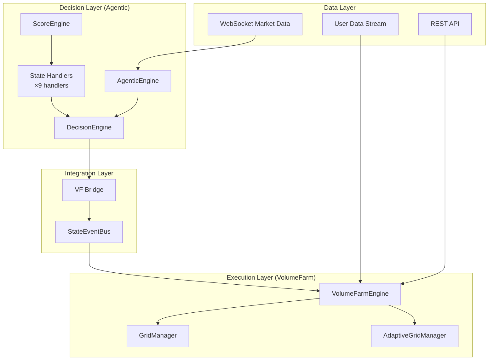
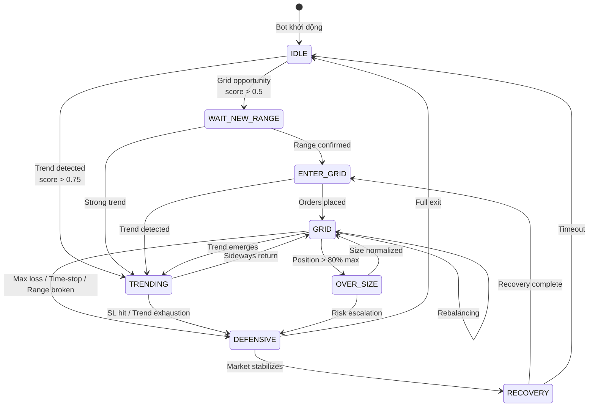
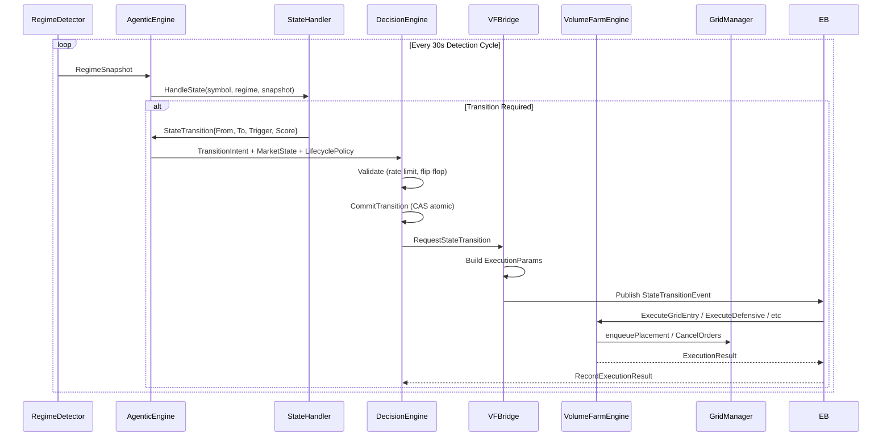
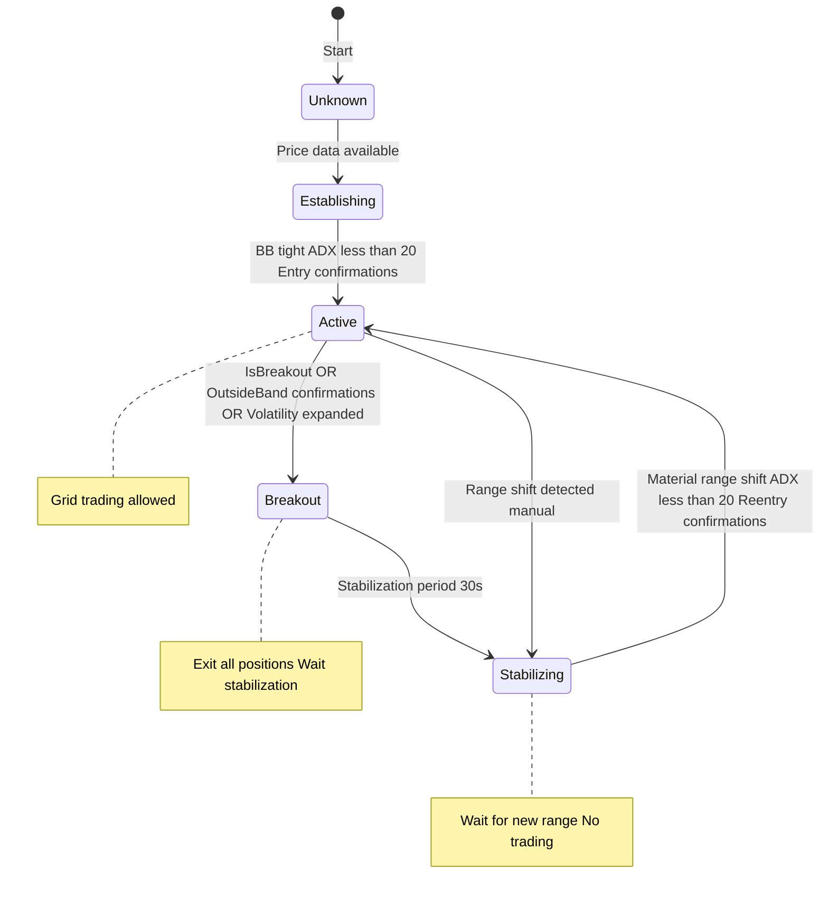

# AGENTIC TRADING - Nghiệp Vụ Vận Hành (Updated 2026-04-22)

## 1. Tổng Quan Hệ Thống

### 1.1 Định Nghĩa
Agentic Trading là hệ thống giao dịch thông minh tự động sử dụng **Hybrid Architecture** với 2 layer:
- **Decision Layer (AgenticEngine)**: Phân tích thị trường, quyết định state transitions
- **Execution Layer (VolumeFarmEngine)**: Thực thi lệnh, quản lý grid, TP/SL, re-grid



### 1.2 Kiến Trúc 2 Layer

| Layer | Components | Responsibility |
|-------|------------|----------------|
| **Decision** | AgenticEngine, DecisionEngine, 9 StateHandlers | What to do (state transitions) |
| **Execution** | VolumeFarmEngine, GridManager, AdaptiveGridManager | How to do it (order placement) |

**Flow:** Handler produces TransitionIntent → DecisionEngine validates → VF Bridge builds ExecutionParams → VolumeFarmEngine executes

---

## 2. State Machine - 9 States (Unified)



### 2.1 State Definitions

| State | Entry Condition | Allow Orders | Description |
|-------|-----------------|--------------|-------------|
| **IDLE** | Initial | ❌ | Chờ opportunity, tính scores |
| **WAIT_NEW_RANGE** | Grid score > 0.5 | ❌ | Chờ range boundaries confirmed |
| **ENTER_GRID** | Range ready | ✅ | Đặt lệnh grid, signal-triggered entry |
| **GRID** | Orders active | ✅ | Grid trading chính, rebalancing |
| **TRENDING** | Trend score > 0.75 | ✅* | Trend following với TP/SL |
| **OVER_SIZE** | Position > 80% max | ❌ | Position quá lớn, giảm size |
| **DEFENSIVE** | Risk trigger | ❌ | Phòng thủ, graduated exit |
| **RECOVERY** | After loss | ❌ | Recovery cooldown, adjust params |
| **IDLE** (exit) | Full exit | ❌ | Dừng trading symbol |

*TRENDING: VF quyết định implementation (grid hoặc directional)

### 2.2 State Transitions - Business Rules

| From | To | Trigger | Score Threshold |
|------|----|---------|-----------------|
| IDLE | TRENDING | trend_score > 0.75 | 0.75 |
| IDLE | WAIT_NEW_RANGE | grid_score > 0.5 | 0.5 |
| WAIT_NEW_RANGE | ENTER_GRID | Range confirmed + signal | 0.6 |
| ENTER_GRID | GRID | Orders placed successfully | - |
| GRID | DEFENSIVE | max_loss / time_stop / range_broken | 0.85-0.95 |
| GRID | TRENDING | Trend detected | 0.7 |
| TRENDING | DEFENSIVE | SL hit / exhaustion | 0.8-0.95 |
| DEFENSIVE | RECOVERY | PnL improves | 0.6 |
| RECOVERY | ENTER_GRID | Cooldown complete | 0.5 |

---

## 3. Decision Flow (Handler → DE → VF)

### 3.1 Flow Chi Tiết



### 3.2 DecisionEngine - Validation Logic

| Check | Logic | Action if Fail |
|-------|-------|----------------|
| Rate Limiting | Max transitions/minute | Reject transition |
| Flip-Flop | Same transition within 5min | Reject + increment counter |
| Hard Kill Switch | Config flag | Reject all |
| Per-Symbol Loss Cap | RealizedPnL < -cap | Force IDLE |
| State Consistency | FromState == CurrentState | Update FromState |

---

## 4. Volume-First Trading Modes

### 4.1 Mục Tiêu Chính

**80% thời gian**: GRID_FARM micro-profit + volume
**20% thời gian**: TRENDING theo xu hướng

| Chế Độ | Mục Tiêu | Position Age Target |
|--------|----------|---------------------|
| GRID | Micro-profit, high volume | **2-8 phút** |
| TRENDING | Trend capture | 15-30 phút (probe) / 4h (follow) |
| DEFENSIVE | Capital protection | N/A |

### 4.2 Time-Stop (Micro-Profit Focus)

| State | Max Time | Hành Động |
|-------|----------|-----------|
| GRID | **8 phút** | → DEFENSIVE (time_limit) |
| TRENDING (probe) | 30 phút | → DEFENSIVE |
| TRENDING (follow) | 4 giờ | → DEFENSIVE |
| ENTER_GRID | 2 phút | → IDLE (timeout) |

### 4.3 TP/SL Bands (Volume-First)

| Band | Target Bps | Close Ratio | Điều Kiện |
|------|------------|-------------|-----------|
| TP1 | 12 bps (0.12%) | 50% | Maker-only |
| TP2 | 18 bps (0.18%) | 30% | Maker-only |
| TP3 | 24 bps (0.24%) | 20% | Maker-only |
| Hard SL | 28 bps (0.28%) | 100% | Market order |
| Time Stop | 8 phút | 100% | Market order |

---

## 5. Execution Layer (VolumeFarm)

### 5.1 Execute Methods - Thực Thi Thật

| Method | Logic | Real Order |
|--------|-------|------------|
| `ExecuteGridEntry` | Whitelist add, apply params, enqueue placement | ✅ Có |
| `ExecuteDefensive` | Whitelist remove, cancel orders, **partial/exit positions** | ✅ Có |
| `ExecuteTrendEntry` | Whitelist remove, ExitAll, force TRENDING state | ✅ Có |
| `ExecuteAccumulation` | 30% size grid entry | ✅ Có |
| `ExecuteRecovery` | 50% partial exit, force RECOVERY | ✅ Có |
| `ExecuteIdle` | Full exit defensive | ✅ Có |

### 5.2 Grid Parameters Applied

Khi `ExecuteGridEntry` được gọi, params từ Agentic được apply:

```
1. PositionSizeMultiplier × BaseOrderSize
2. GridSpread từ ExecutionContext.SpreadBps
3. TP bands từ LifecyclePolicy.TPBands
4. SL policy từ LifecyclePolicy.SLPolicy
5. TimeStop từ LifecyclePolicy.SLPolicy.TimeStopSec
6. RegridPolicy (AllowImmediate, MinRangeQuality)
```

### 5.3 Partial Exit Logic (DEFENSIVE)

Khi `exitPct = 0.5` (50% exit):

1. Get position từ WebSocket cache
2. Calculate reduceQty = |positionAmt| × exitPct
3. Place **MARKET order** ReduceOnly
4. Force state DEFENSIVE

---

## 6. Circuit Breakers & Safety

### 6.1 Circuit Breaker Callbacks (Wired)

| Callback | Trigger | Action |
|----------|---------|--------|
| `SetOnTripCallback` | Volatility spike / Consecutive losses | `TriggerEmergencyExit()` |
| `SetOnResetCallback` | Conditions normalize | `TriggerForcePlacement()` |

### 6.2 Blocking Points (9 Points)

| Point | Block Condition | Unblock Logic |
|-------|-----------------|---------------|
| 1. tradingPaused | `pauseTrading()` called | `TryResumeTrading()` khi range ready |
| 2. cooldownActive | 3+ consecutive losses | Win recorded |
| 3. RegridCooldown | Manual activation | Auto-expire hoặc manual clear |
| 4. RangeDetector | State = Breakout/Stabilizing | Auto-transition khi ổn định |
| 5. TimeFilter | Outside trading hours | Auto khi vào giờ |
| 6. RateLimiter | Token bucket empty | Auto refill |
| 7. SpreadProtection | Spread > threshold | Auto khi spread normalize |
| 8. Position Limits | Notional > max | Gradual reduction / emergency close |
| 9. CircuitBreaker | Tripped by volatility/loss | Auto-reset sau evaluate (3s) |

---

## 7. Re-Grid Logic

### 7.1 Conditions (ALL must true)

| # | Condition | Threshold | Source |
|---|-----------|-----------|--------|
| 1 | Zero open orders | count == 0 | GridManager |
| 2 | Zero position | notional < $10 | WebSocket cache |
| 3 | ADX low | < 70 | TrendDetector |
| 4 | BB width contraction | < 10× last | RangeDetector |
| 5 | Range shift | > 0.01% | RangeDetector |
| 6 | State | IDLE hoặc WAIT_NEW_RANGE | GridStateMachine |

### 7.2 Fallback (5 phút timeout)

Nếu ở WAIT_NEW_RANGE > 5 phút, force regrid bypass market conditions.

---

## 8. Whitelist Management

| Parameter | Value | Description |
|-----------|-------|-------------|
| Enabled | `true` | Tự động quản lý |
| Max Symbols | Configurable | Mặc định 5 |
| Min Score to Add | 0.5 (grid) / 0.75 (trend) | Ngưỡng thêm symbol |

**Flow:**
- `ExecuteGridEntry`: Add to whitelist
- `ExecuteGridExit`: Remove from whitelist
- `UpdateWhitelist`: Triggered by Agentic decisions

---

## 9. Operational Commands

### 9.1 Khởi Động

```bash
# VF only mode
./agentic-bot --vf-only

# Full Agentic + VF
./agentic-bot --config=config/agentic-vf-config.yaml

# API port override
./agentic-bot --port=8081
```

### 9.2 Graceful Shutdown

1. Stop Agentic Engine (stop decisions)
2. Stop Volume Farm Engine (close positions)
3. Cancel main context
4. Exit

---

## 10. Key Performance Indicators

| Metric | Target | Measurement |
|--------|--------|-------------|
| State Transition Latency | < 100μs | Handler → DE → VF |
| Order Placement Latency | < 500ms | Decision → Exchange ACK |
| Position Age (GRID) | 2-8 min | Time in GRID state |
| Grid Re-entry Time | < 5 min | EXIT_ALL → GRID |
| Uptime | > 99% | Continuous operation |
| Win Rate (GRID) | 65-70% | Micro-profit target |

---

*Version: 4.0 (Aligned with Core Implementation 2026-04-22)*
*Architecture: Hybrid Agentic + VolumeFarm with State Machine*

### 17.1 Circuit Breaker Logic (Agentic Engine)

Circuit breaker trong Agentic Engine có 2 loại:

```mermaid
graph TD
    A CircuitBreaker Check --> B isTripped
    
    B -->|Yes| C Auto reset after 5min
    B -->|No| D Check Conditions
    
    C -->|Yes| E Reset Continue check
    C -->|No| F Return true Block trading
    
    E --> D
    
    D --> G Volatility Spike Check
    D --> H Consecutive Losses Check
    
    G --> I Volatility Spike
    H --> J Losses greater than Threshold
    
    I -->|Yes| K Trip volatility spike
    J -->|Yes| L Trip consecutive losses
    
    I -->|No| M Continue
    J -->|No| M
    
    K --> N Return true Block trading
    L --> N
    
    M --> O Return false Allow trading
```

**Volatility Spike Detection:**
```
1. Track ATR history (max 20 values)
2. Calculate average ATR from history
3. Check if current ATR > avgATR × ATRMultiplier
4. At least 1/3 of symbols must show spike
5. If true → Trip circuit breaker

Config:
- ATRMultiplier: 3.0 (default)
- Spike threshold: 1/3 of symbols
- Auto-reset: 5 minutes
```

**Consecutive Losses Detection:**
```
1. Record trade outcome (win/loss)
2. Track consecutive losses
3. If consecutive losses >= Threshold → Trip
4. Win → Reset counter

Config:
- Threshold: 3 (default)
- Auto-reset: 5 minutes
```

**Circuit Breaker Impact:**
- Khi tripped → Skip whitelist update
- Block new symbol addition
- Không trigger COOLDOWN trong farming engine
- Manual reset available via API

---

### 17.2 Breakout Detection Logic (RangeDetector)

Breakout được detect trong RangeDetector khi **1 trong 3 điều kiện** thỏa mãn:

```mermaid
graph TD
    A RangeState Active --> B Price in Range
    
    B -->|No| C outsideBandCount increment
    B -->|Yes| D outsideBandCount reset to 0
    
    C --> E Condition 1 IsBreakout
    D --> E
    
    E --> F Condition 2 outsideBandCount greater than Confirmations
    E --> G Condition 3 Volatility Expanded
    
    F --> H Any condition true
    G --> H
    
    H -->|Yes| I RangeState Breakout
    H -->|No| J Continue Active
    
    I --> K Trigger ExitExecutor Cancel Close
    I --> L Wait Stabilization 30s
    
    L --> M RangeState Stabilizing
```

**Condition 1: IsBreakout (Price exceeds BB band with threshold)**
```
IsBreakout(price, threshold):
- Breakout trên: price > UpperBound × (1 + threshold)
- Breakout dưới: price < LowerBound × (1 - threshold)

Config:
- BreakoutThreshold: 0.01 (1%)
- UpperBound/LowerBound: Bollinger Bands (2σ)
```

**Condition 2: Outside Band Confirmations**
```
- Track số lần price ở ngoài BB band
- Nếu outsideBandCount >= OutsideBandConfirmations → Breakout

Config:
- OutsideBandConfirmations: 2 (default)
- Reset counter khi price trở lại trong range
```

**Condition 3: Volatility Expanded**
```
isVolatilityExpandedLocked():
- Track width history (BB width)
- Calculate average width from history
- Check if current width >= avgWidth × BBExpansionFactor

Config:
- BBExpansionFactor: 1.5 (default)
- Width history: max(Periods/2, 3) values
```

**Breakout Flow:**
```
1. RangeState: Active → Breakout detected
2. breakoutTime = now()
3. Trigger AdaptiveGridManager.handleBreakout()
4. ExitExecutor.ExecuteFastExit():
   - T+0ms: Cancel ALL orders
   - T+100ms: Close positions (market orders)
   - T+5s: Verify closure
5. GridStateMachine: TRADING → EXIT_ALL
6. Wait stabilization period (30s)
7. RangeState: Breakout → Stabilizing
8. Wait for new range conditions
9. RangeState: Stabilizing → Active (re-entry)
```

---

### 17.3 Range State Machine (Detailed)



**State Transitions:**

| From | To | Condition | Action |
|------|-----|-----------|--------|
| **Unknown** | Establishing | Price data available | Calculate indicators |
| **Establishing** | Active | Entry confirmations met | Set lastAcceptedRange |
| **Active** | Breakout | IsBreakout OR OutsideBand >= 2 OR Volatility expanded | Trigger ExitExecutor |
| **Breakout** | Stabilizing | Stabilization period (30s) | Wait for new range |
| **Stabilizing** | Active | Material range shift (≥0.5%) + ADX < 20 + Reentry confirmations | Resume trading |

---

### 17.4 Config Parameters Summary

| Parameter | Default Value | Description |
|-----------|---------------|-------------|
| **BreakoutThreshold** | 0.01 (1%) | % vượt BB band để trigger breakout |
| **OutsideBandConfirmations** | 2 | Số lần price ở ngoài band trước breakout |
| **BBExpansionFactor** | 1.5 | Tỷ lệ width expansion để trigger breakout |
| **StabilizationPeriod** | 30s | Thời gian chờ sau breakout |
| **MaterialShiftPct** | 0.005 (0.5%) | Tỷ lệ range shift để re-entry |
| **EntryConfirmations** | 1 | Số confirmations để entry range |
| **ReentryConfirmations** | 3 | Số confirmations để re-entry |
| **ATRMultiplier** | 3.0 | Tỷ lệ ATR để detect volatility spike |
| **ConsecutiveLosses** | 3 | Số losses liên tiếp để trip circuit breaker |
| **Auto-reset** | 5min | Thời gian auto-reset circuit breaker |

---

### 17.5 Example Scenarios

**Scenario 1: Price Breakout Upward**
```
- Current price: 50,000
- UpperBound: 49,500
- BreakoutThreshold: 0.01 (1%)
- UpperBound × (1 + 0.01) = 49,500 × 1.01 = 49,995
- Price > 49,995 → IsBreakout = true → Breakout triggered
```

**Scenario 2: Volatility Spike**
```
- ATR history: [100, 110, 120, 130, 140]
- Average ATR: 120
- Current ATR: 400
- ATRMultiplier: 3.0
- 400 > 120 × 3.0 = 360 → Volatility spike detected
- Circuit breaker tripped → Block trading
```

**Scenario 3: Consecutive Losses**
```
- Trade 1: PnL = -10 → consecutiveLosses = 1
- Trade 2: PnL = -15 → consecutiveLosses = 2
- Trade 3: PnL = -20 → consecutiveLosses = 3
- Threshold: 3 → Circuit breaker tripped
- Trade 4: PnL = +5 → consecutiveLosses = 0 (reset)
```

---

*Document Version: 5.0*  
*Last Updated: 2026-04-15*  
*Aligns with: Core Flow Implementation (T001-T054) - Phase 1-9 Complete + Balance USD1+USDT + Duplicate Fill Handling + Circuit Breaker & Breakout Detection*
