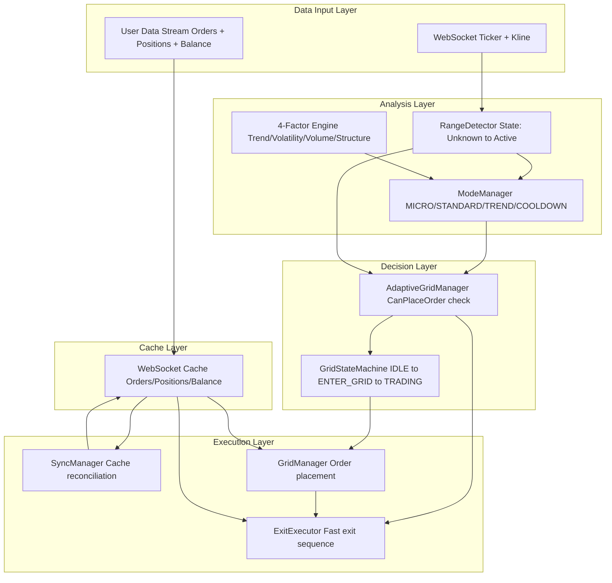
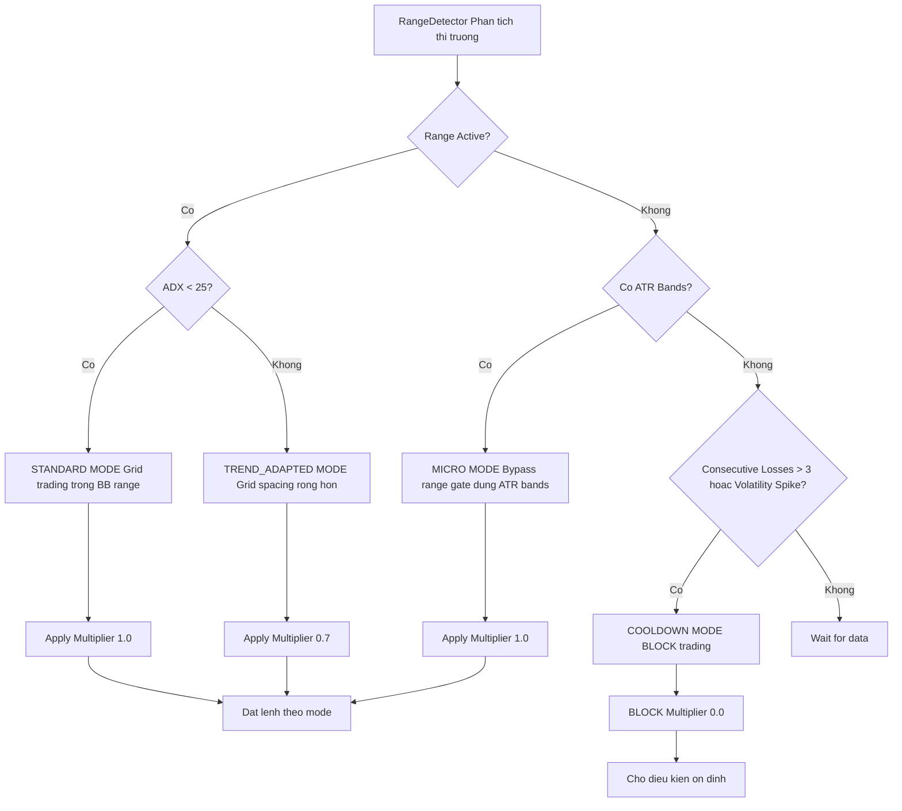
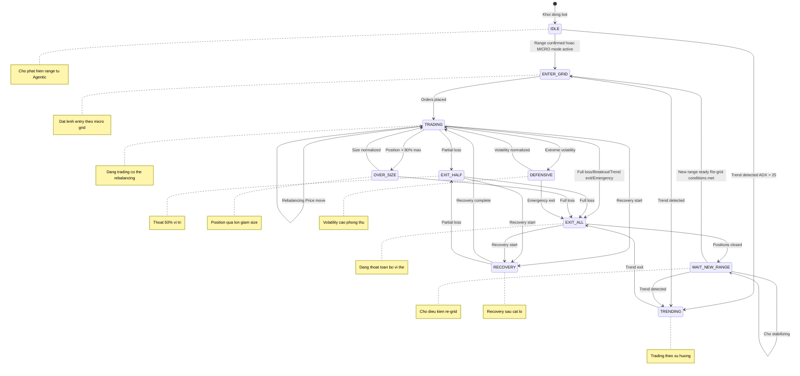
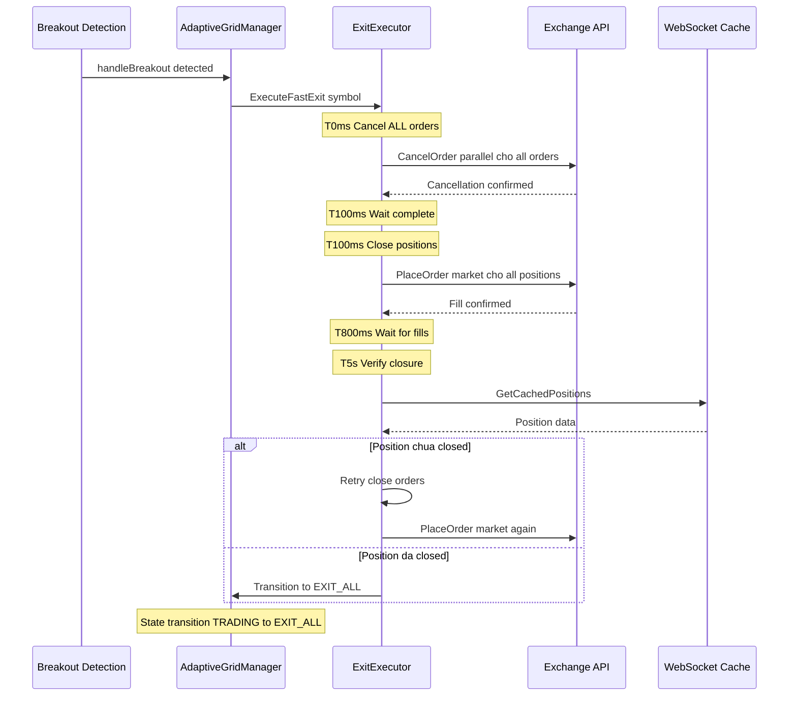
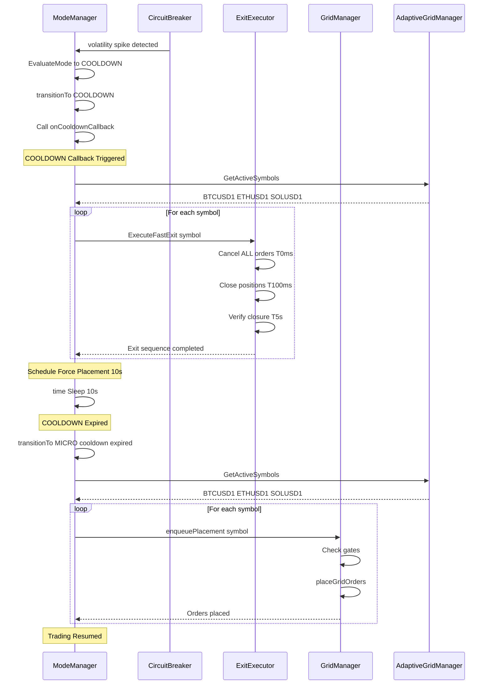
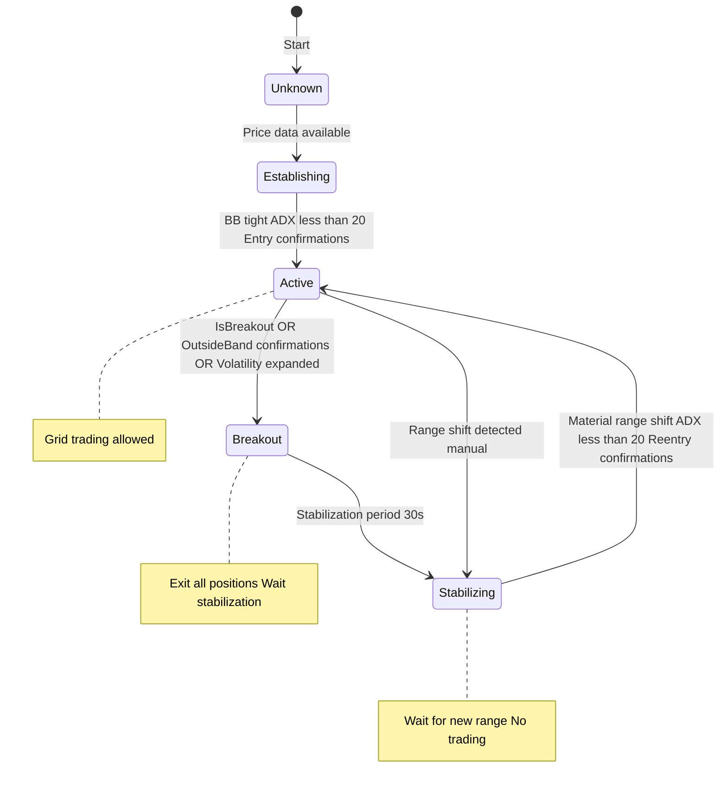

# AGENTIC TRADING - Nghiệp Vụ Vận Hành

## 1. Tổng Quan Hệ Thống

### 1.1 Định Nghĩa
Agentic Trading là hệ thống giao dịch thông minh tự động điều chỉnh chiến lược dựa trên phân tích thị trường theo thời gian thực. Hệ thống tự động nhận biết chế độ thị trường, tính toán điểm số đa yếu tố, điều chỉnh kích thước lệnh/grid spacing phù hợp, và sử dụng **trading modes** (MICRO, STANDARD, TREND_ADAPTED, COOLDOWN) để adaptive risk control.

**Tổng quan kiến trúc hệ thống:**



### 1.2 Trading Modes (Mới - Phase 2)

Hệ thống sử dụng **4 Trading Modes** để điều chỉnh chiến lược giao dịch:

| Mode | Điều Kiện Kích Hoạt | Chiến Lược | Sizing Multiplier |
|------|-------------------|-----------|-------------------|
| **MICRO** | Range not active, ATR bands available | Bypass strict range gate, dùng ATR bands | 1.0 |
| **STANDARD** | Range active, ADX < 25 | Grid trading trong BB range | 1.0 |
| **TREND_ADAPTED** | Range active, ADX > 25 | Grid với spacing rộng hơn | 0.7 |
| **COOLDOWN** | Consecutive losses > 3 hoặc volatility spike | **BLOCK** trading, chờ ổn định | 0.0 |

**ModeManager Flow:**



### 1.3 Các Chế Độ Thị Trường (Regime) & State Machine

Hệ thống sử dụng **Unified State Machine** với 9 states (Updated Phase 8):



| State | Điều Kiện Vào | Cho Phép Đặt Lệnh | Mô Tả |
|-------|---------------|-------------------|-------|
| **IDLE** | Khởi động | ❌ | Chờ phát hiện range từ Agentic |
| **ENTER_GRID** | Range confirmed hoặc MICRO mode active | ✅ | Đặt lệnh entry theo micro grid |
| **TRADING** | Orders placed | ✅ | Đang trading, có thể rebalancing |
| **EXIT_HALF** | Partial loss | ❌ | Thoát 50% vị thế |
| **EXIT_ALL** | Full loss/Breakout/Trend/Emergency | ❌ | Đang thoát toàn bộ vị thế |
| **WAIT_NEW_RANGE** | Positions closed | ❌ | Chờ điều kiện regrid (shift ≥ 0.5%, BB contract) |
| **OVER_SIZE** | Position > 80% max | ❌ | Position quá lớn, giảm size |
| **DEFENSIVE** | Extreme volatility | ❌ | Volatility cao, phòng thủ |
| **RECOVERY** | Recovery start | ❌ | Recovery sau cắt lỗ |
| **TRENDING** | Trend detected ADX > 25 | ✅ | Trading theo xu hướng |

| Chế Độ Thị Trường | Đặc Điểm | Chiến Lược Grid |
|-------------------|----------|-----------------|
| **Sideways** | Giá dao động trong biên độ hẹp, ADX < 20 | Micro grid 0.05%, 5 orders/side, dynamic leverage cao |
| **Trending** | Xu hướng rõ ràng, ADX > 25 | TREND_ADAPTED mode, spacing rộng hơn |
| **Breakout** | Vượt BB bands | **EXIT ALL** - chờ stabilizing |
| **Stabilizing** | Sau breakout, chờ BB mới | Không trading |

**Lưu ý Quan Trọng:**
- **MICRO mode bypass**: Khi range not active, dùng ATR bands để bypass strict range gate
- ModeManager check trước khi placement → block nếu COOLDOWN
- Micro grid (0.05% spread) là **primary geometry**, BB chỉ dùng để gate permission
- Re-grid chỉ xảy ra sau khi qua WAIT_NEW_RANGE với điều kiện nghiêm ngặt

### 1.3 Điểm Số Triển Khai (Recommendation)

```
HIGH (RecHigh): Triển khai full size (multiplier 1.0)
MEDIUM (RecMedium): Triển khai reduced size (multiplier 0.6)
LOW (RecLow): Monitor only, giảm size (multiplier 0.3)
SKIP (RecSkip): Chờ đợi, không triển khai (multiplier 0.0)

Lưu ý: Code sử dụng Recommendation enum thay vì score số để tránh mâu thuẫn về ngưỡng
```

### 1.4 Whitelist Management (Enabled by Default)

| Tham Số | Giá Trị | Mô Tả |
|---------|---------|-------|
| Enabled | `true` | Tự động quản lý whitelist |
| Max Symbols | 5 | Số symbol tối đa trong whitelist |
| Min Score to Add | 60 | Ngưỡng điểm tối thiểu để thêm symbol |
| Universe | BTCUSD1, ETHUSD1, SOLUSD1 | Danh sách mặc định |

---

## 2. Quy Trình Khởi Động (Cold Start)

### 2.1 Warm-up Phase
1. **Load dữ liệu lịch sử**: Hệ thống tự động tải 1000 nến gần nhất từ API
2. **Tính toán chỉ báo**: ADX, Bollinger Band, ATR, EMA (9, 21, 50, 200)
3. **Xác định chế độ**: Phân tích chỉ báo để xác định regime hiện tại
4. **Sẵn sàng giao dịch**: Chờ tích lũy đủ dữ liệu (không cần 2 lần đọc giống nhau)

### 2.2 Pattern Learning Phase
- **Giai đoạn 1 (0-200 trades)**: Chỉ thu thập dữ liệu, chưa dùng pattern
- **Giai đoạn 2 (≥200 trades + accuracy ≥60%)**: Pattern bắt đầu ảnh hưởng ±5 điểm vào score
- **Decay công thức**: Pattern cũ có trọng số giảm theo thời gian `exp(-days/14)`

---

## 3. Circuit Breakers - Cầu Chì An Toàn

### 3.1 5 Cầu Chì Tự Động (Đã Implement)

| Cầu Chì | Điều Kiện Kích Hoạt | Hành Động | Ưu Tiên |
|---------|---------------------|-----------|---------|
| **ADX Spike** | ADX > 25 (trend mạnh) | Exit all, transition EXIT_ALL | 1 |
| **BB Expansion** | BB width > 1.5% | Exit all, chờ contraction | 1 |
| **Breakout** | Giá ngoài BB 2+ candles | Cancel orders, close positions | 1 |
| **Consecutive Losses** | > 3 losses liên tiếp | Pause + 30s cooldown | 2 |
| **Multi-Layer Liquidation** | Tier 1-4 distance | Tier1: warn, Tier2: reduce 50%, Tier3: close all, Tier4: hedge+close | 3 |

**Real-time Exit Monitor:**
- Goroutine riêng kiểm tra ADX/BB mỗi **100ms** (không phụ thuộc WebSocket)
- Thread-safe với mutex, idempotent (tránh duplicate exit)

> **Note**: State machine đảm bảo chỉ có 1 exit path duy nhất, không bị race condition

### 3.2 Reset Cầu Chì
- **Tự động**: Sau thời gian chờ (30s - 5 phút tùy cầu chì)
- **Thủ công**: Operator có thể reset qua API/command

---

## 4. ExitExecutor - Fast Exit Sequence (Mới - Phase 4)

### 4.1 Fast Exit Logic

ExitExecutor cung cấp chuỗi thoát nhanh khi breakout detected:



### 4.2 ExitExecutor Features

| Feature | Implementation |
|---------|----------------|
| **Cancel Orders** | Parallel cancellation với T+100ms timeout |
| **Close Positions** | Market orders cho tất cả positions |
| **Verify Closure** | Check WebSocket cache sau T+5s |
| **Retry Logic** | Tự động retry nếu position chưa closed |
| **Fallback** | Nếu ExitExecutor fail → dùng ExitAll() cũ |

**Wiring:**
- AdaptiveGridManager.handleBreakout() → ExitExecutor.ExecuteFastExit()
- Type assertion để gọi interface method (tránh circular dependency)

---

## 5. SyncManager - Cache Sync Workers (Mới - Phase 7)

### 5.1 Sync Workers Architecture

SyncManager điều phối 3 sync workers để reconcile internal cache với REST API:

```mermaid
graph TD
    subgraph SM Sync Manager
        OSW Order Sync Worker 30s interval
        PSW Position Sync Worker 30s interval
        BSW Balance Sync Worker 30s interval
    end

    subgraph Cache WebSocket Cache
        OC Order Cache
        PC Position Cache
        BC Balance Cache
    end

    subgraph REST REST API
        RO GetOpenOrders
        RP GetPositions
        RB GetAccountBalance
    end

    OSW --> OC
    OSW --> RO
    OSW -->|Compare and Log mismatches| OC

    PSW --> PC
    PSW --> RP
    PSW -->|Compare and Log mismatches| PC

    BSW --> BC
    BSW --> RB
    BSW -->|Alert if low| BC
```

### 5.2 Sync Worker Logic

| Worker | Interval | Logic | Fallback |
|--------|----------|-------|----------|
| **Order Sync** | 30s | Reconcile cache orders with REST API | Log mismatches |
| **Position Sync** | 30s | Reconcile cache positions with REST API | Log mismatches |
| **Balance Sync** | 30s | Reconcile cache balance with REST API | Alert if low |

**Cache Stale Detection:**
- IsCacheStale(cacheType) → check last update timestamp
- TTL: 60s cho orders, 60s cho positions, 60s cho balance
- Nếu stale → fallback to REST API

**Wiring:**
- VolumeFarmEngine.Start() → SyncManager.Start()
- VolumeFarmEngine.Stop() → SyncManager.Stop()

---

## 6. WebSocket Cache & Auto-Sync (Mới - Phase 6)

### 6.1 Cache Architecture

WebSocketClient có 3 cache structures với auto-sync từ user data stream:

```mermaid
graph LR
    subgraph WS WebSocket User Data Stream
        LK listenKey
        AU ACCOUNT UPDATE Event
        OU ORDER TRADE UPDATE Event
    end

    subgraph Cache WebSocket Cache
        OC Order Cache TTL 60s
        PC Position Cache TTL 60s
        BC Balance Cache TTL 60s
    end

    subgraph Handlers Event Handlers
        AH OnAccountUpdate
        OH OnOrderUpdate
    end

    LK --> AU
    LK --> OU

    AU --> AH
    OU --> OH

    AH -->|Update| PC
    AH -->|Update| BC

    OH -->|Update| OC
    OH -->|Remove| OC

    Cache -->|Get Data| Trading Trading Logic
    Cache -->|Fallback| REST REST API
```

### 6.2 Cache Methods

| Method | Mô Tả |
|--------|-------|
| `GetCachedOrders(symbol)` | Lấy orders từ cache |
| `GetCachedPositions()` | Lấy positions từ cache |
| `GetCachedBalance()` | Lấy balance từ cache |
| `UpdateOrderCache(order)` | Update order khi nhận event |
| `RemoveOrderCache(symbol, orderID)` | Xóa order khi filled/cancelled |
| `UpdatePositionCache(position)` | Update position khi nhận event |
| `UpdateBalanceCache(balance)` | Update balance khi nhận event |
| `IsCacheStale(cacheType)` | Check cache có stale không |
| `SubscribeToUserData(listenKey)` | Subscribe user data stream |

**Auto-Sync Flow:**
1. Create listenKey via REST API
2. Subscribe to user data WebSocket stream
3. Parse ACCOUNT_UPDATE → Update position/balance cache
4. Parse ORDER_TRADE_UPDATE → Update/remove order cache
5. Sync workers periodically reconcile with REST API

**Benefits:**
- Giảm REST API calls (chỉ dùng khi cache stale)
- Real-time updates từ WebSocket
- Fallback to REST API khi cần

---

## 7. Yếu Tố Tính Toán Điểm Số (4 Factors)

### 7.1 Trọng Số Các Yếu Tố

| Yếu Tố | Trọng Số | Ý Nghĩa |
|--------|----------|---------|
| **Trend** | 30% | Xu hướng thị trường (EMA alignment, ADX) |
| **Volatility** | 25% | Mức độ biến động (ATR, BB width) |
| **Volume** | 25% | Khối lượng giao dịch (vs MA20) |
| **Structure** | 20% | Cấu trúc giá (support/resistance) |

### 7.2 Hệ Số Điều Chỉnh Theo Chế Độ

```
Trending: Trend +20%, Volatility -10%
Sideways: Volatility +15%, Volume +10%
Volatile: Tất cả yếu tố bị giảm trọng số
Recovery: Dần dần trở về bình thường
```

---

## 8. Quản Lý Vị Thế

### 8.1 Công Thức Kích Thước Lệnh

```
final_size = base_size × score_multiplier × volatility_multiplier × leverage_multiplier

Trong đó:
- score_multiplier: 1.0 (HIGH), 0.6 (MEDIUM), 0.3 (LOW), 0.0 (SKIP) - dựa trên Recommendation enum
- volatility_multiplier: 1.0 (normal), 0.5 (high), 0.0 (extreme)
- leverage_multiplier: Dynamic leverage theo BB width (inverse proportion)

Dynamic Leverage Formula:
- BB width 0.2% → 100x (tight range)
- BB width 0.5% → 80x (normal)
- BB width 1.0% → 40x (wide)
- BB width 2.0% → 20x (volatile, capped)
```

**T012: BB Period Unified = 10** (Cả Agentic và Execution dùng chung)

### 8.2 Grid Configuration (Micro Grid Priority)

**T003: Micro Grid là Primary Geometry** (Ưu tiên cao nhất)

| Tham Số | Giá Trị | Mô Tả |
|---------|---------|-------|
| Spread | **0.05%** (0.0005) | Khoảng cách giữa các lệnh |
| Orders/Side | **5** | Tổng 10 lệnh (5 buy + 5 sell) |
| Min Order | **$3** | Minimum order size USDT |
| BB Period | **10** | Fast detection (T012) |
| BB Multiplier | 2.0 | Standard deviation |
| ADX Threshold | 20 | Ngưỡng sideways vs trending |

**Fallback:** Nếu micro grid disabled → Dùng BB bands để tính grid geometry

---

## 9. Logging & Audit

### 9.1 Log Level Configuration (Updated)
Log level đã được điều chỉnh để giảm verbosity:
- **agentic-vf-config.yaml**: `log.level: warn` (từ "info")
- **volume-farm-config.yaml**: `log.level: warn` (từ "info")
- **agentic-config.yaml**: `logging.log_level: warn` (từ "info")

**Impact:**
- Chỉ log WARN và ERROR level
- Giảm log spam, tập trung vào critical information
- Debug logs vẫn available nếu cần (change config)

### 9.2 Decision Log
Mỗi quyết định được ghi nhận:
- Timestamp
- Regime hiện tại + confidence
- 4 factors (giá trị + đóng góp)
- Final score + multipliers
- Grid parameters (spacing, size)
- Pattern matches (nếu có)
- Rationale (lý do quyết định)

### 9.3 Regrid Condition Logging (Phase 8.6)
Detailed logging cho regrid conditions:
- `Standard regrid check START` - bắt đầu check
- `Standard regrid check: position not zero` - nếu position > 10
- `Market condition check: ADX` - giá trị ADX hiện tại
- `Market condition check: BB width ratio` - ratio BB width
- `Standard regrid check: forcing regrid due to timeout fallback` - sau 5 phút

### 9.4 Retention
- File log: `decisions_YYYY-MM-DD.jsonl`
- Thời gian lưu: 90 ngày
- Nén file cũ sau 30 ngày

---

## 10. Các Cặp Giao Dịch Hỗ Trợ

| Cặp | Pattern Storage File | Min Trades để Active |
|-----|---------------------|---------------------|
| BTC/USD1 | `btcusd1_patterns.json` | 200 |
| ETH/USD1 | `ethusd1_patterns.json` | 200 |
| SOL/USD1 | `solusd1_patterns.json` | 200 |

Mỗi cặp có pattern storage riêng, accuracy tracking riêng.

---

## 11. Re-grid Logic (Market-Based Conditions Only)

Chỉ cho phép re-grid khi **TẤT CẢ** điều kiện sau đúng (KHÔNG có time-based cooldown):

| Điều Kiện | Ngưỡng | Kiểm Tra |
|-----------|--------|----------|
| 1. Zero open orders | actual == 0 | GridManager |
| 2. Zero position | positionAmt ≈ 0 (dust < 10 USDT allowed) | Position tracker |
| 3. ADX low | < 70 (sideways/trending nhẹ) | TrendDetector |
| 4. BB width contraction | < 10x last accepted (không quá volatile) | RangeDetector |
| 5. Range shift | > 0.01% (có sự thay đổi đủ lớn) | RangeDetector |
| 6. State | IDLE hoặc WAIT_NEW_RANGE | GridStateMachine |

**Flow:**
```
EXIT_ALL → [UpdatePriceForRange check positions=0] → WAIT_NEW_RANGE
WAIT_NEW_RANGE → [UpdatePriceForRange check isReadyForRegrid] → ENTER_GRID
```

**Quan trọng:**
- **KHÔNG có regrid cooldown** - chỉ dựa vào market conditions
- UpdatePriceForRange được gọi mỗi tick (mỗi khi có kline mới)
- isReadyForRegrid() được evaluate liên tục để detect khi thị trường ổn định

---

## 11.1 Cleanup Worker - Dọn Dẹp Tự Động

**Mục đích:** Tránh race condition khi orders/positions còn sót trong non-trading states

**Logic:**
```go
Chạy mỗi 10s:
  Check state IDLE/EXIT_ALL/WAIT_NEW_RANGE
    ↓
  Cancel all orders
    ↓
  Close all positions
    ↓
  State sạch sẽ → sẵn sàng reentry
```

**States được dọn dẹp:**
- IDLE: Không nên có orders/positions
- EXIT_ALL: Đang thoát, cần dọn sạch
- WAIT_NEW_RANGE: Chờ range mới, không nên trade

---

## 11.2 Auto-Recovery Logic - Tự Động Unblock

**Mục đích:** Force transition nếu stuck quá lâu trong 1 state

**Logic (chạy mỗi 30s - Continuous State Timeout Checker):**
```go
Continuous State Timeout Checker (runs for entire bot lifetime):
  1. RangeDetector Unknown/Initializing
     → Force initialize (30s stabilization)

  2. GridStateExitAll > 10min
     → Force WAIT_NEW_RANGE (assume positions closed)

  3. GridStateWaitNewRange > 10min
     → Force ENTER_GRID (assume new range ready)

  4. GridStateOverSize > 15min
     → Force TRADING (assume size normalized)

  5. GridStateDefensive > 20min
     → Force TRADING (assume volatility normalized)

  6. GridStateRecovery > 10min
     → Force TRADING (assume recovery complete)

  7. tradingPaused in IDLE/WAIT_NEW_RANGE
     → Auto resume
```

**State Timeouts (Phase 8.5 - Continuous Checker):**
- EXIT_ALL: 10 phút
- WAIT_NEW_RANGE: 10 phút
- OVER_SIZE: 15 phút
- DEFENSIVE: 20 phút
- RECOVERY: 10 phút
- IDLE: Không có timeout

**Regrid Fallback Logic (Phase 8.6 - 5 phút fallback):**
```go
canRegridStandard() với fallback:
  1. Check position ≈ 0 (notional < 10.0)
  2. Check market conditions (ADX < 70, BB width < 10x)
  3. Nếu market conditions fail:
     - Check time in state
     - Nếu > 5 phút trong WAIT_NEW_RANGE:
       → Force regrid (bypass market conditions)
     - Log: "forcing regrid due to timeout fallback"
```

**Multi-Layer Protection:**
1. **Fallback trong regrid conditions** (5 phút) - allow regrid ngay cả khi market conditions fail
2. **Continuous state timeout checker** (10 phút) - force transition state
3. **Emergency force state method** - manual recovery khi cần

**Detailed Logging (Phase 8.6):**
- `Standard regrid check START` - bắt đầu check
- `Standard regrid check: position not zero` - nếu position > 10
- `Market condition check: ADX` - giá trị ADX hiện tại
- `Market condition check: BB width ratio` - ratio BB width
- `Standard regrid check: forcing regrid due to timeout fallback` - sau 5 phút

---

## 12. Monitoring & Alert

### 12.1 Tình Huống Cảnh Báo
- **Regime Change**: Thông báo ngay khi chế độ thị trường thay đổi
- **Circuit Breaker**: Cảnh báo khẩn cấp + SMS/email nếu cầu chì drawdown/volatility kích hoạt
- **High Drawdown**: Cảnh báo khi drawdown > 5% (trước khi chạm 10% cầu chì)

### 12.2 Rate Limiting Alert
- Tối đa 1 alert/5 phút cho mỗi loại
- Tránh spam khi thị trường biến động liên tục

---

## 13. Operational Commands

### 13.1 Khởi Động Bot
```
# Test mode (không giao dịch thật)
./agentic-bot --config=config.yaml --symbol=BTCUSDT --test

# Live mode (có giao dịch thật)
./agentic-bot --config=config.yaml --symbol=BTCUSDT
```

### 13.2 Các Thao Tác Quản Lý
- **Dừng**: Ctrl+C hoặc SIGTERM → Graceful shutdown, save patterns
- **Check status**: Log file hoặc API `/health`
- **Reset breaker**: API POST hoặc command

---

## 14. State Machine JSONL Logging

Mọi state transition được log với format JSONL:

```json
{
  "timestamp": "2026-04-12T07:45:00Z",
  "symbol": "BTCUSD1",
  "from_state": "TRADING",
  "to_state": "EXIT_ALL",
  "event": "TREND_EXIT",
  "reason": "adx_spike",
  "adx_value": 28.5,
  "bb_width_pct": 1.2
}
```

## 15. KPIs & Performance Targets

| Chỉ Số | Target | Đo Lường |
|--------|--------|----------|
| State Transition | < 10μs | Thời gian chuyển state |
| Real-time Exit Latency | < 100ms | Từ detect ADX/BB → exit action |
| Regime Detection | 30s | Khoảng cách giữa các lần detect |
| Micro Grid Placement | < 500ms | Thời gian đặt 10 lệnh |
| Re-grid Wait Time | 30s-5m | Tùy điều kiện thị trường |
| Uptime | > 99% | Thời gian hoạt động liên tục |

---

---

### 16.1 Flow Khởi Động Bot (Cold Start)

```mermaid
graph TB
    Start Khoi Dong Bot --> LoadConfig Load Config YAML
    LoadConfig --> InitComponents Khoi Tao Components
    
    InitComponents --> WS WebSocket Client Ticker Stream
    InitComponents --> UDS User Data Stream Orders Positions Balance
    InitComponents --> RD RangeDetector State Machine
    InitComponents --> MM ModeManager 4 Trading Modes
    InitComponents --> GSM GridStateMachine 5 States
    InitComponents --> AGM AdaptiveGridManager Risk Control
    InitComponents --> GM GridManager Order Placement
    InitComponents --> EE ExitExecutor Fast Exit
    InitComponents --> SM SyncManager 3 Workers
    
    WS --> Warmup Warm up Phase
    UDS --> Warmup
    RD --> Warmup
    MM --> Warmup
    GSM --> Warmup
    
    Warmup --> LoadHistory Load 1000 Candles REST API
    LoadHistory --> CalcIndicators Tinh Chi Bao ADX BB ATR EMA
    CalcIndicators --> DetectRegime Phat Hien Regime Sideways Trending Breakout
    DetectRegime --> Ready San Sang Trade
    
    Ready --> StartLoop Bat Dau Main Loop
```

**Giải thích:**
1. Bot load config từ YAML
2. Khởi tạo tất cả components (WebSocket, RangeDetector, ModeManager, etc.)
3. Warm-up phase: Load 1000 nến lịch sử
4. Tính chỉ báo kỹ thuật (ADX, Bollinger, ATR, EMA)
5. Phát hiện regime hiện tại
6. Sẵn sàng trade → Bắt đầu main loop

---

### 16.2 Flow Vào Lệnh (Entry Logic)

```mermaid
graph TD
    A WebSocket Ticker Update Price Change --> B shouldSchedulePlacement
    
    B -->|No| C Skip Cho price move
    B -->|Yes| D enqueuePlacement
    
    D --> E canPlaceForSymbol
    E -->|No| F BLOCK Log reason
    E -->|Yes| G ModeManager CanPlaceOrder
    
    G -->|No| H COOLDOWN BLOCK Log reason
    G -->|Yes| I GridStateMachine ShouldEnqueuePlacement
    
    I -->|No| J State BLOCK Cho state change
    I -->|Yes| K Placement Queue Wait for worker
    
    K --> L placementWorker Dequeue symbol
    L --> M canPlaceForSymbol
    M -->|No| N BLOCK Runtime gate
    M -->|Yes| O ModeManager CanPlaceOrder
    
    O -->|No| P COOLDOWN BLOCK
    O -->|Yes| Q GridState ENTER GRID TRADING
    
    Q -->|No| R State BLOCK
    Q -->|Yes| S placeGridOrders
    
    S --> T Micro Grid Enabled
    T -->|Yes| U placeMicroGridOrders 0.05 spread 5 orders side
    T -->|No| V placeBBGridOrders BB bands geometry
    
    U --> W Calculate Order Size Score x Volatility x Leverage
    V --> W
    
    W --> X Place Orders REST API
    X --> Y OnOrderUpdate WebSocket Event
    Y --> Z Update Order Cache
    Z --> AA Orders Active TRADING state
```

**Giải thích:**
1. WebSocket ticker update → Check nên schedule placement
2. Enqueue placement vào queue
3. Worker dequeue → Check gates:
   - canPlaceForSymbol (AdaptiveGridManager)
   - ModeManager (MICRO/STANDARD/TREND_ADAPTED/COOLDOWN)
   - GridStateMachine (ENTER_GRID/TRADING)
4. Place orders:
   - Micro grid (0.05% spread, 5 orders/side) - PRIMARY
   - Fallback: BB grid geometry
5. Calculate order size: Score × Volatility × Leverage
6. Place orders via REST API
7. WebSocket update order cache
8. Orders active → TRADING state

---

### 16.3 Flow Trading (Rebalancing)

```mermaid
graph TD
    A TRADING State Orders Active --> B Price Move
    
    B --> C Order Filled WebSocket Event
    C -->|No| D Cho fills
    C -->|Yes| E handleOrderFill
    
    E --> F Dedup Check IsDuplicate
    F -->|Yes| G LOG WARNING Van trigger rebalance
    F -->|No| H Process Fill
    
    G --> I Track Position InventoryManager
    H --> I
    
    I --> J canRebalance
    J -->|No| K BLOCK Risk limits
    J -->|Yes| L enqueuePlacement Rebalance
    
    L --> M placementWorker
    M --> N Cancel Filled Order Place New Order
    
    N --> O Balance Sufficient
    O -->|No| P BLOCK Low balance
    O -->|Yes| Q Place New Order Grid rebalancing
    
    Q --> R Update Order Cache
    R --> S Continue TRADING
```

**Giải thích:**
1. Price move → Orders filled
2. handleOrderFill called
3. Dedup check (vẫn trigger rebalance dù duplicate)
4. Track position trong InventoryManager
5. Check canRebalance (risk limits)
6. Enqueue placement để rebalance
7. Cancel filled order, place new order
8. Check balance sufficient
9. Place new order
10. Continue TRADING

---

### 16.4 Flow Thoát Lệnh (Exit Logic)

```mermaid
graph TD
    A TRADING State --> B Exit Trigger
    
    B --> C Breakout Detected Price outside BB
    B --> D ADX Spike ADX > 25
    B --> E Consecutive Losses greater than 3
    B --> F Volatility Spike Circuit Breaker
    
    C --> G handleBreakout
    D --> H handleTrendExit
    E --> I handleLossExit
    F --> J handleVolatilityExit
    
    G --> K ExitExecutor ExecuteFastExit
    H --> K
    I --> K
    J --> K
    
    K --> L T0ms Cancel ALL orders
    L --> M T100ms Wait cancellation
    M --> N T100ms Close positions Market orders
    N --> O T800ms Wait for fills
    O --> P T5s Verify closure
    
    P --> Q Position closed
    Q -->|No| R Retry close orders
    Q -->|Yes| S Transition to EXIT ALL
    
    R --> N
    
    S --> T Clear Grid
    T --> U Pause Trading
    U --> V Transition to WAIT NEW RANGE
```

**Giải thích:**
1. Exit triggers:
   - Breakout (price outside BB)
   - ADX spike (ADX > 25)
   - Consecutive losses (> 3)
   - Volatility spike (circuit breaker)
2. Call ExitExecutor.ExecuteFastExit
3. Fast exit sequence:
   - T+0ms: Cancel ALL orders
   - T+100ms: Wait cancellation complete
   - T+100ms: Close positions (market orders)
   - T+800ms: Wait for fills
   - T+5s: Verify closure via cache
4. If not closed → Retry
5. Transition to EXIT_ALL → WAIT_NEW_RANGE

---

### 16.5 Flow Chờ Re-Grid (WAIT_NEW_RANGE)

```mermaid
graph TD
    A WAIT NEW RANGE State --> B Re grid Conditions
    
    B --> C 1 Zero open orders
    B --> D 2 Zero position
    B --> E 3 Range shift greater than 0.5
    B --> F 4 BB width less than 1.5x
    B --> G 5 ADX less than 20
    
    C --> H All conditions met
    D --> H
    E --> H
    F --> H
    G --> H
    
    H -->|No| I WAIT Check again in 30s
    H -->|Yes| J New Range Ready
    
    J --> K Transition to ENTER GRID
    K --> L placeGridOrders New grid geometry
    L --> M TRADING State Orders Active
    
    I --> B
```

**Giải thích:**
1. WAIT_NEW_RANGE state
2. Check 6 strict conditions:
   - Zero open orders
   - Zero position
   - Range shift ≥ 0.5%
   - BB width < 1.5x
   - ADX < 20
   - State = WAIT_NEW_RANGE
3. Nếu không meet → Wait 30s, check lại
4. Nếu meet → New range ready
5. Transition to ENTER_GRID
6. Place new grid orders
7. TRADING state

---

### 16.6 Flow Trading Modes (ModeManager)

```mermaid
graph TD
    A ModeManager EvaluateMode --> B Get Market Conditions
    
    B --> C RangeDetector State + ADX + Breakout
    C --> D Range Active
    
    D -->|Yes| E ADX less than 25
    D -->|No| F Has ATR Bands
    
    E -->|Yes| G STANDARD MODE Multiplier 1.0 Grid trading trong BB range
    E -->|No| H TREND ADAPTED MODE Multiplier 0.7 Grid spacing rong hon
    
    F -->|Yes| I MICRO MODE Multiplier 1.0 Bypass range gate Dung ATR bands
    F -->|No| J Volatility Spike
    
    J -->|Yes| K COOLDOWN MODE Multiplier 0.0 BLOCK trading 10s duration
    J -->|No| L Breakout plus Momentum
    
    L -->|Yes| K
    L -->|No| I
    
    G --> M Apply Parameters
    H --> M
    I --> M
    K --> N BLOCK Placement
    
    M --> O CanPlaceOrder true
    N --> P CanPlaceOrder false
    
    O --> Q Place Orders Theo mode
    P --> R Cho mode change Sau 10s
    
    R --> A
```

**Giải thích:**
1. ModeManager.EvaluateMode called trước placement
2. Get market conditions từ RangeDetector
3. Determine mode:
   - **STANDARD**: Range active + ADX < 25 → Grid trading trong BB range
   - **TREND_ADAPTED**: Range active + ADX > 25 → Grid spacing rộng hơn
   - **MICRO**: Range not active + Has ATR bands → Bypass range gate, dùng ATR bands
   - **COOLDOWN**: Volatility spike hoặc Breakout + Momentum → BLOCK trading (10s)
4. Apply parameters theo mode
5. CanPlaceOrder = true/false
6. Place orders hoặc chờ mode change

---

### 16.7 Flow COOLDOWN Mode (Emergency Exit + Re-entry)



**Giải thích:**
1. Circuit breaker detect volatility_spike
2. ModeManager → COOLDOWN (10s)
3. COOLDOWN callback triggered:
   - Get all active symbols
   - ExecuteFastExit cho mỗi symbol
   - Cancel orders + close positions
4. Sau 10s → COOLDOWN expired
5. Transition to MICRO mode
6. Force grid placement cho tất cả symbols
7. Trading resumed

---

### 16.8 Flow Balance Handling (USD1 + USDT)

```mermaid
graph TB
    A WebSocket ACCOUNT UPDATE --> B processAccountUpdate
    
    B --> C Extract Balance Data
    C --> D Balance Data Available
    
    D -->|Yes| E Loop through balance array
    D -->|No| F Log Warning No balance data
    
    E --> G Asset USD1 or USDT
    G -->|Yes| H Aggregate Balance
    G -->|No| I Skip asset
    
    H --> J Total Wallet Balance
    H --> K Total Available Balance
    H --> L Total Margin Balance
    
    J --> M Update Balance Cache
    K --> M
    L --> M
    
    M --> N Log Balance updated aggregated
    N --> O Balance Sync Worker 30s interval
    
    O --> P Balance Low
    P -->|Yes| Q Low Balance Alert available less than 100
    P -->|No| R Normal
    
    Q --> S Skip Placement Insufficient balance
    R --> T Allow Placement Balance sufficient
```

**Giải thích:**
1. WebSocket ACCOUNT_UPDATE event
2. Extract balance data
3. Loop through balance array
4. Aggregate USD1 + USDT balances
5. Update balance cache (aggregated)
6. Balance sync worker reconcile với REST API (30s)
7. If balance low (< 100) → Alert + Skip placement
8. If balance sufficient → Allow placement

---

### 16.9 Flow Duplicate Fill Handling

```mermaid
graph TD
    A Order Fill Event WebSocket or Polling --> B handleOrderFill
    
    B --> C Validate State Transition
    C --> D Valid transition
    
    D -->|No| E LOG WARNING Invalid transition
    D -->|Yes| F Dedup Check IsDuplicate
    
    E --> G SKIP Return
    
    F -->|Yes| H LOG WARNING Duplicate detected Van trigger rebalance
    F -->|No| I Process Fill
    
    H --> J Track Position InventoryManager
    I --> J
    
    J --> K canRebalance
    K -->|No| L BLOCK Risk limits
    K -->|Yes| M enqueuePlacement Trigger rebalance
    
    M --> N Place New Order
    N --> O Continue Trading
```

**Giải thích:**
1. Order fill event từ WebSocket hoặc Polling
2. Validate state transition
3. Dedup check:
   - Nếu duplicate → LOG WARNING nhưng VẪ trigger rebalance
   - Nếu không duplicate → Process fill
4. Track position trong InventoryManager
5. Check canRebalance
6. Enqueue placement để rebalance
7. Place new order
8. Continue trading

---

### 16.10 Tóm Tắt Trading Flow

```mermaid
graph TB
    Start Start Bot --> Warmup Warm up Load 1000 candles
    Warmup --> Ready Ready to Trade
    
    Ready --> IDLE IDLE State
    IDLE --> ENTER GRID ENTER GRID Range confirmed
    
    ENTER GRID --> TRADING TRADING State Orders Active
    
    TRADING --> Fill Order Filled
    Fill --> Rebalance Rebalance Place new order
    Rebalance --> TRADING
    
    TRADING --> Exit Exit Trigger Breakout ADX Loss
    Exit --> EXIT ALL EXIT ALL Fast exit sequence
    
    EXIT ALL --> WAIT WAIT NEW RANGE Cho stabilizing
    WAIT --> Check Re grid conditions
    
    Check -->|No| WAIT
    Check -->|Yes| ENTER GRID
    
    TRADING --> COOLDOWN COOLDOWN Volatility spike
    COOLDOWN --> AutoExit Auto Exit Cancel Close
    AutoExit --> Wait10s Wait 10s
    Wait10s --> MICRO MICRO Mode Force placement
    MICRO --> TRADING
```

---

## 17. Circuit Breaker & Breakout Detection Logic

### 17.1 Circuit Breaker Logic (Agentic Engine)

Circuit breaker trong Agentic Engine có 2 loại:

```mermaid
graph TD
    A CircuitBreaker Check --> B isTripped
    
    B -->|Yes| C Auto reset after 5min
    B -->|No| D Check Conditions
    
    C -->|Yes| E Reset Continue check
    C -->|No| F Return true Block trading
    
    E --> D
    
    D --> G Volatility Spike Check
    D --> H Consecutive Losses Check
    
    G --> I Volatility Spike
    H --> J Losses greater than Threshold
    
    I -->|Yes| K Trip volatility spike
    J -->|Yes| L Trip consecutive losses
    
    I -->|No| M Continue
    J -->|No| M
    
    K --> N Return true Block trading
    L --> N
    
    M --> O Return false Allow trading
```

**Volatility Spike Detection:**
```
1. Track ATR history (max 20 values)
2. Calculate average ATR from history
3. Check if current ATR > avgATR × ATRMultiplier
4. At least 1/3 of symbols must show spike
5. If true → Trip circuit breaker

Config:
- ATRMultiplier: 3.0 (default)
- Spike threshold: 1/3 of symbols
- Auto-reset: 5 minutes
```

**Consecutive Losses Detection:**
```
1. Record trade outcome (win/loss)
2. Track consecutive losses
3. If consecutive losses >= Threshold → Trip
4. Win → Reset counter

Config:
- Threshold: 3 (default)
- Auto-reset: 5 minutes
```

**Circuit Breaker Impact:**
- Khi tripped → Skip whitelist update
- Block new symbol addition
- Không trigger COOLDOWN trong farming engine
- Manual reset available via API

---

### 17.2 Breakout Detection Logic (RangeDetector)

Breakout được detect trong RangeDetector khi **1 trong 3 điều kiện** thỏa mãn:

```mermaid
graph TD
    A RangeState Active --> B Price in Range
    
    B -->|No| C outsideBandCount increment
    B -->|Yes| D outsideBandCount reset to 0
    
    C --> E Condition 1 IsBreakout
    D --> E
    
    E --> F Condition 2 outsideBandCount greater than Confirmations
    E --> G Condition 3 Volatility Expanded
    
    F --> H Any condition true
    G --> H
    
    H -->|Yes| I RangeState Breakout
    H -->|No| J Continue Active
    
    I --> K Trigger ExitExecutor Cancel Close
    I --> L Wait Stabilization 30s
    
    L --> M RangeState Stabilizing
```

**Condition 1: IsBreakout (Price exceeds BB band with threshold)**
```
IsBreakout(price, threshold):
- Breakout trên: price > UpperBound × (1 + threshold)
- Breakout dưới: price < LowerBound × (1 - threshold)

Config:
- BreakoutThreshold: 0.01 (1%)
- UpperBound/LowerBound: Bollinger Bands (2σ)
```

**Condition 2: Outside Band Confirmations**
```
- Track số lần price ở ngoài BB band
- Nếu outsideBandCount >= OutsideBandConfirmations → Breakout

Config:
- OutsideBandConfirmations: 2 (default)
- Reset counter khi price trở lại trong range
```

**Condition 3: Volatility Expanded**
```
isVolatilityExpandedLocked():
- Track width history (BB width)
- Calculate average width from history
- Check if current width >= avgWidth × BBExpansionFactor

Config:
- BBExpansionFactor: 1.5 (default)
- Width history: max(Periods/2, 3) values
```

**Breakout Flow:**
```
1. RangeState: Active → Breakout detected
2. breakoutTime = now()
3. Trigger AdaptiveGridManager.handleBreakout()
4. ExitExecutor.ExecuteFastExit():
   - T+0ms: Cancel ALL orders
   - T+100ms: Close positions (market orders)
   - T+5s: Verify closure
5. GridStateMachine: TRADING → EXIT_ALL
6. Wait stabilization period (30s)
7. RangeState: Breakout → Stabilizing
8. Wait for new range conditions
9. RangeState: Stabilizing → Active (re-entry)
```

---

### 17.3 Range State Machine (Detailed)



**State Transitions:**

| From | To | Condition | Action |
|------|-----|-----------|--------|
| **Unknown** | Establishing | Price data available | Calculate indicators |
| **Establishing** | Active | Entry confirmations met | Set lastAcceptedRange |
| **Active** | Breakout | IsBreakout OR OutsideBand >= 2 OR Volatility expanded | Trigger ExitExecutor |
| **Breakout** | Stabilizing | Stabilization period (30s) | Wait for new range |
| **Stabilizing** | Active | Material range shift (≥0.5%) + ADX < 20 + Reentry confirmations | Resume trading |

---

### 17.4 Config Parameters Summary

| Parameter | Default Value | Description |
|-----------|---------------|-------------|
| **BreakoutThreshold** | 0.01 (1%) | % vượt BB band để trigger breakout |
| **OutsideBandConfirmations** | 2 | Số lần price ở ngoài band trước breakout |
| **BBExpansionFactor** | 1.5 | Tỷ lệ width expansion để trigger breakout |
| **StabilizationPeriod** | 30s | Thời gian chờ sau breakout |
| **MaterialShiftPct** | 0.005 (0.5%) | Tỷ lệ range shift để re-entry |
| **EntryConfirmations** | 1 | Số confirmations để entry range |
| **ReentryConfirmations** | 3 | Số confirmations để re-entry |
| **ATRMultiplier** | 3.0 | Tỷ lệ ATR để detect volatility spike |
| **ConsecutiveLosses** | 3 | Số losses liên tiếp để trip circuit breaker |
| **Auto-reset** | 5min | Thời gian auto-reset circuit breaker |

---

### 17.5 Example Scenarios

**Scenario 1: Price Breakout Upward**
```
- Current price: 50,000
- UpperBound: 49,500
- BreakoutThreshold: 0.01 (1%)
- UpperBound × (1 + 0.01) = 49,500 × 1.01 = 49,995
- Price > 49,995 → IsBreakout = true → Breakout triggered
```

**Scenario 2: Volatility Spike**
```
- ATR history: [100, 110, 120, 130, 140]
- Average ATR: 120
- Current ATR: 400
- ATRMultiplier: 3.0
- 400 > 120 × 3.0 = 360 → Volatility spike detected
- Circuit breaker tripped → Block trading
```

**Scenario 3: Consecutive Losses**
```
- Trade 1: PnL = -10 → consecutiveLosses = 1
- Trade 2: PnL = -15 → consecutiveLosses = 2
- Trade 3: PnL = -20 → consecutiveLosses = 3
- Threshold: 3 → Circuit breaker tripped
- Trade 4: PnL = +5 → consecutiveLosses = 0 (reset)
```

---

*Document Version: 5.0*  
*Last Updated: 2026-04-15*  
*Aligns with: Core Flow Implementation (T001-T054) - Phase 1-9 Complete + Balance USD1+USDT + Duplicate Fill Handling + Circuit Breaker & Breakout Detection*
