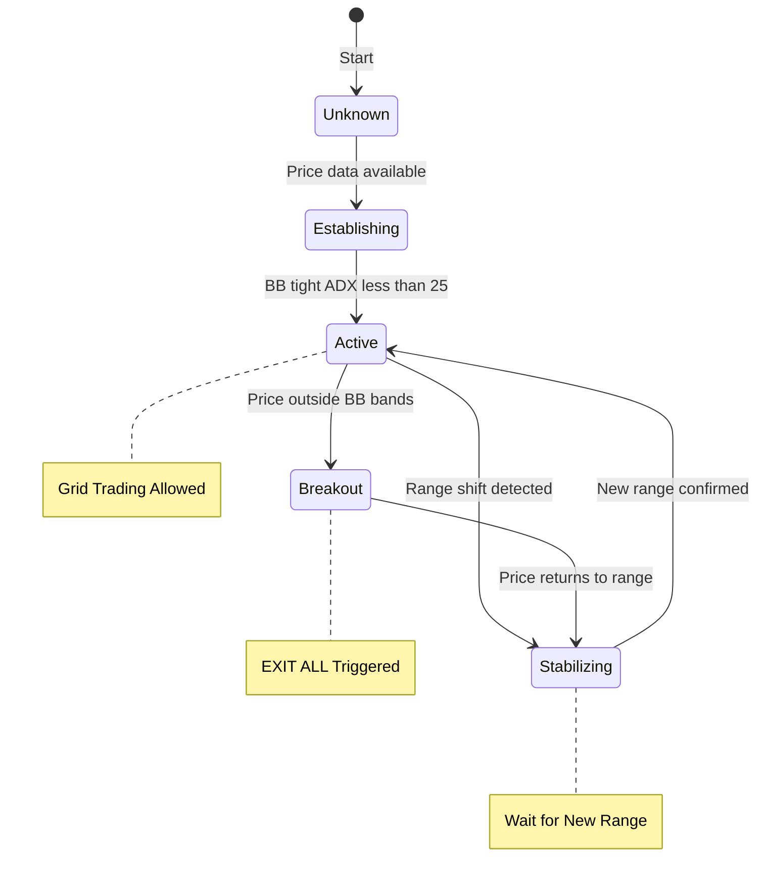

# AGENTIC TRADING - Technical Flow & Architecture

## 1. Tổng Quan Kiến Trúc (Unified State Machine - Updated)

**Kiến trúc hệ thống v3.0:**

```mermaid
graph TB
    subgraph Data Data Layer
        WS1 WebSocket kline 1m
        WS2 User Data Stream ACCOUNT UPDATE ORDER TRADE UPDATE
    end

    subgraph Core Core Engine
        RD RangeDetector State Unknown to Active
        MM ModeManager 4 Trading Modes
        FE 4 Factor Engine Scoring 0 to 100
        GSM GridStateMachine 5 States
    end

    subgraph Execution Execution Layer
        AGM AdaptiveGridManager CanPlaceOrder
        GM GridManager Order placement
        EE ExitExecutor Fast exit
        SM SyncManager 3 Workers
    end

    subgraph Cache Cache Layer
        WC WebSocket Cache Orders Pos Bal
    end

    subgraph Exchange Exchange
        API REST API Fallback
        WSS WebSocket Server
    end

    WS1 --> RD
    WS2 --> WC

    RD --> MM
    FE --> MM
    RD --> GSM
    MM --> AGM

    AGM --> GM
    GSM --> GM

    AGM --> EE
    GSM --> EE

    WC --> SM
    SM --> WC

    WC --> GM
    WC --> EE

    GM --> API
    EE --> API
    SM --> API

    WS1 --> WSS
    WS2 --> WSS

    style Data fill:#E6E6FA
    style Core fill:#90EE90
    style Execution fill:#FFD700
    style Cache fill:#87CEEB
    style Exchange fill:#FF6347
```

**NEW COMPONENTS (Phase 2-8):**
- ModeManager: MICRO/STANDARD/TREND_ADAPTED/COOLDOWN modes
- ExitExecutor: Fast exit sequence (T+0ms cancel, T+100ms close)
- SyncManager: Order/Position/Balance sync workers (30s interval)
- WebSocket Cache: Real-time cache with auto-sync from user data stream

**State Machine Controls:**
- RangeDetector: Unknown → Establishing → Active → Breakout → Stabilizing
- GridStateMachine: IDLE → ENTER_GRID → TRADING → EXIT_ALL → WAIT_NEW_RANGE
- ModeManager: Evaluate trading mode based on market conditions

---

## 2. Luồng Dữ Liệu Thị Trường

### 2.1 Warm-up Flow (Khởi Động)

```mermaid
graph LR
    A Start Bot --> B REST API klines
    B --> C 1000 Candles Pre load
    C --> D Indicator Calculate
    D --> E ADX BB ATR EMAs
    E --> F Regime Detect
    F --> G Ready to Trade
```

**Mô tả:**
1. Bot khởi động, gọi REST API lấy 1000 nến lịch sử
2. Tính toán chỉ báo kỹ thuật (ADX, Bollinger, ATR, các EMA)
3. Xác định regime hiện tại từ chỉ báo
4. Chuyển sang trạng thái sẵn sàng giao dịch (không cần hysteresis)

### 2.2 Real-time Flow (Vận Hành)

```mermaid
graph TB
    WS WebSocket kline 1m --> NC New Candle Arrival
    NC --> SW Slide Window 1000 max
    SW --> UI Update Indicators
    UI --> RC Recalculate All
    RC --> DR Detect Regime
    DR --> RC2 Regime Change
    RC2 --> FS 4 Factors Scoring
    FS --> S0 Score 0 to 100
    S0 --> PM Pattern Matching
    PM --> PS Position Sizing
    PS --> GA Grid Adapter
    GA --> GP Grid Params Applied
    GP --> EW Execute Wait
    EW --> CB Circuit Breakers
    CB --> DL Decision Log
```

**Mô tả (V3 - Continuous Price Feed + Auto-Recovery):**
- **Global kline processor start ngay khi GridManager khởi tạo** (không đợi warmup)
- WebSocket đẩy nến mới mỗi phút → Update RangeDetector + StateMachine
- **T001**: `shouldSchedulePlacement()` kiểm tra **cả** `RangeState == Active` **và** `GridState ∈ {ENTER_GRID, TRADING}`
- **T003**: Micro grid (0.05% spread, 5 orders/side) là **primary geometry**, BB chỉ dùng để gate permission
- Recalculate chỉ báo → Detect regime → Scoring 4 factors
- **T002**: Dynamic leverage dựa trên BB width (inverse proportion)
- **T009**: Real-time exit goroutine monitor ADX/BB mỗi **100ms**
- **T011**: Multi-layer liquidation protection (4-tier: warn→reduce50%→close→hedge)
- State machine điều khiển placement gating, không chỉ là advisory
- **Cleanup worker chạy mỗi 10s** để dọn orders/positions trong non-trading states
- **Auto-recovery chạy mỗi 30s** để force transition nếu stuck

### 2.3 ModeManager Flow (Mới - Phase 2)

```mermaid
graph TD
    A RangeDetector State ADX Breakout --> B Range Active
    B -->|Co| C ADX less than 25
    B -->|Khong| D Has ATR Bands
    C -->|Co| E STANDARD Multiplier 1.0
    C -->|Khong| F TREND ADAPTED Multiplier 0.7
    D -->|Co| G MICRO ATR Bands Multiplier 1.0
    D -->|Khong| H Consecutive Losses greater than 3
    H -->|Co| I COOLDOWN BLOCK Multiplier 0.0
    H -->|Khong| J Wait for Data

    E --> K Apply Parameters
    F --> K
    G --> K
    I --> L Block Placement

    K --> M CanPlaceOrder true
    L --> N CanPlaceOrder false
```

**Wiring:**
- AdaptiveGridManager.CanPlaceOrder() → ModeManager.EvaluateMode()
- GridManager.canPlaceForSymbol() → AdaptiveGridManager.CanPlaceOrder()
- Type assertion để tránh circular dependency

### 2.4 Order Placement Flow

```mermaid
graph TD
    A WebSocket Ticker Update --> B processWebSocketTicker
    B --> C shouldSchedule Placement
    C -->|Yes| D enqueuePlacement
    C -->|No| E Skip

    D --> F canPlaceFor Symbol
    F -->|Yes| G ModeManager CanPlaceOrder
    F -->|No| H Block Placement

    G -->|Yes| I GridState Valid
    G -->|No| J COOLDOWN Block

    I -->|Yes| K placeGridOrders
    I -->|No| L Wait for State Change

    K --> M Micro Grid 0.05 spread 10 orders
    K --> N BB Grid Fallback

    M --> O Orders Placed
    N --> O

    O --> P OnOrderUpdate WebSocket
    P --> Q Update Order Cache
```

---

## 3. Luồng Phân Tích Chế Độ & State Machine (T001-T015)



**Grid State Machine:**

```mermaid
stateDiagram
    [*] --> IDLE: Start
    IDLE --> ENTER GRID: Range confirmed or MICRO mode
    ENTER GRID --> TRADING: Orders placed
    TRADING --> EXIT ALL: Breakout Trend ADX greater than 25
    TRADING --> TRADING: Rebalancing
    EXIT ALL --> WAIT NEW RANGE: Positions closed
    WAIT NEW RANGE --> ENTER GRID: Re grid conditions met

    note right of TRADING: Orders active Grid trading
    note right of EXIT ALL: Fast exit sequence
    note right of WAIT NEW RANGE: 6 strict conditions
```

**Classification Logic:**
- Sideways:  ADX < 25, BB width < 0.5%, RangeState = Active → Grid Trading
- Trending:  ADX > 25 → EventTrendExit → EXIT_ALL
- Breakout:  Price outside BB → EventEmergencyExit → EXIT_ALL
- Stabilizing: After breakout, wait for new range → WAIT_NEW_RANGE

### 3.1 State Machine Auto-Transitions (UpdatePriceForRange)

```mermaid
graph TB
    UPF UpdatePriceForRange called every tick --> CS Check Current State

    CS --> IDLE IDLE State
    CS --> WNR WAIT NEW RANGE State
    CS --> EA EXIT ALL State

    IDLE --> IFR isReadyForRegrid
    IFR -->|Yes| T1 Transition ENTER GRID
    IFR -->|No| IFR

    WNR --> IFR
    T1 --> T1 Record enterGridTime

    EA --> PZ Check positions zero
    PZ -->|Yes| T2 Transition WAIT NEW RANGE
    PZ -->|No| CS2 Check stuck 30s
    CS2 -->|Yes| FC Force close position
    CS2 -->|No| EA

    FC --> EA
    T2 --> WNR
```

**Logic trong UpdatePriceForRange (được gọi mỗi tick):**
- **IDLE state**: Check `isReadyForRegrid()` → transition ENTER_GRID nếu market conditions ổn định
- **WAIT_NEW_RANGE state**: Check `isReadyForRegrid()` → transition ENTER_GRID nếu market conditions ổn định
- **EXIT_ALL state**: Check positions = 0 → transition WAIT_NEW_RANGE
  - Nếu stuck > 30s với positions → force close position

**isReadyForRegrid conditions (market-based only):**
1. State: IDLE hoặc WAIT_NEW_RANGE
2. Position: ≈ 0 (dust < 10 USDT allowed)
3. ADX < 70 (sideways/trending nhẹ)
4. BB width < 10x last accepted (không quá volatile)
5. Range shift > 0.01% (có sự thay đổi)

---

## 4. Luồng Tính Toán Điểm Số (4 Factors Engine)

```mermaid
graph TB
    subgraph Inputs Indicator Inputs
        T Trend 30
        V Volatility 25
        Vo Volume 25
        S Structure 20
    end

    subgraph Metrics Metrics
        EMA EMA Align ADX Strength
        ATR ATR Norm BB Expansion
        VolMA Vol MA20 Trend Dir
        SR Support Res Range Detect
    end

    subgraph Calc Calculation
        WS Weighted Sum Score Calculation
        RM Regime Multiplier
        FS Final Score 0 to 100
    end

    subgraph Cache Cache Layer
        CL 5s TTL Cache Check
    end

    T --> EMA
    V --> ATR
    Vo --> VolMA
    S --> SR

    EMA --> WS
    ATR --> WS
    VolMA --> WS
    SR --> WS

    WS --> RM
    RM --> FS
    FS --> CL

    CL -->|Same indicators within 5s| WS
```

**Cache Layer (5s TTL):**
- Same indicators within 5s → Return cached score
- Reduces CPU usage for frequent detections

---

## 5. Luồng Circuit Breakers & Real-time Exit Monitor (T009)

### 5.1 Real-time Exit Monitor (Goroutine riêng)

```mermaid
graph TB
    Ticker 100ms Ticker --> Check Check All Symbols
    Check --> Trigger Trigger Exit

    Trigger --> ADX ADX greater than 25
    Trigger --> BB BB Width greater than 1.5
    Trigger --> Loss Consecutive Losses greater than 3

    ADX -->|Yes| TE handleTrendExit
    BB -->|Yes| BE handleBreakout
    Loss -->|Yes| BE

    TE --> TE1 Cancel orders
    TE --> TE2 Close positions
    TE --> TE3 Clear grid
    TE --> TE4 pauseTrading
    TE --> TE5 ForceRecalculate
    TE --> TE6 Transition to EXIT ALL

    BE --> BE1 Cancel orders
    BE --> BE2 Close positions
    BE --> BE3 Clear grid
    BE --> BE4 pauseTrading
    BE --> BE5 ForceRecalc
    BE --> BE6 Transition to EXIT ALL
```

**T014 - Idempotent**: exitInProgress flag prevents duplicate exits

### 5.2 Multi-Layer Liquidation Protection (T011)

```mermaid
graph LR
    PM positionMonitor 30s interval --> T1 Distance to liquidation
    T1 -->|50| WARN WARN Log only
    T1 -->|30| REDUCE REDUCE 50 Position
    T1 -->|15| CLOSE CLOSE ALL
    T1 -->|10| HEDGE HEDGE CLOSE

    WARN --> PM
    REDUCE --> PM
    CLOSE --> PM
    HEDGE --> PM
```

**T011**: Enabled by default, wired vào positionMonitor

---

## 6. Luồng ExitExecutor - Fast Exit Sequence (Mới - Phase 4)

```mermaid
graph TB
    BD Breakout Detected --> AE AdaptiveGridManager handleBreakout
    AE --> EE ExitExecutor ExecuteFastExit

    EE --> T0 T0ms Cancel ALL orders
    T0 --> T1 T100ms Wait cancellation
    T1 --> T2 T100ms Close positions market orders
    T2 --> T3 T800ms Wait for fills
    T3 --> T4 T5s Verify closure via cache
    T4 --> T5 Position closed
    T5 -->|No| Retry Retry close orders
    T5 -->|Yes| Transition Transition to EXIT ALL

    Retry --> T2
```

**Implementation:**
- File: `internal/farming/exit_executor.go`
- Method: `ExecuteFastExit(ctx, symbol)`
- Wiring: AdaptiveGridManager.handleBreakout() → ExitExecutor

---

## 7. Luồng SyncManager - Cache Sync Workers (Mới - Phase 7)

```mermaid
graph TB
    VFE VolumeFarmEngine Start --> SM SyncManager Start

    SM --> OSW Order Sync Worker 30s interval
    SM --> PSW Position Sync Worker 30s interval
    SM --> BSW Balance Sync Worker 30s interval

    OSW --> OSW1 GetCachedOrders
    OSW1 --> OSW2 GetOpenOrders REST API
    OSW2 --> OSW3 Compare cache vs REST
    OSW3 --> OSW4 Log mismatches
    OSW4 --> OSW5 Update cache if stale
    OSW5 --> OSW

    PSW --> PSW1 GetCachedPositions
    PSW1 --> PSW2 GetPositions REST API
    PSW2 --> PSW3 Compare cache vs REST
    PSW3 --> PSW4 Log mismatches
    PSW4 --> PSW5 Update cache if stale
    PSW5 --> PSW

    BSW --> BSW1 GetCachedBalance
    BSW1 --> BSW2 GetAccountBalance REST API
    BSW2 --> BSW3 Compare cache vs REST
    BSW3 --> BSW4 Alert if balance low
    BSW4 --> BSW5 Update cache if stale
    BSW5 --> BSW
```

**Implementation:**
- Files: `internal/farming/sync/*.go`
- Manager: `sync/manager.go`
- Workers: `order_sync_worker.go`, `position_sync_worker.go`, `balance_sync_worker.go`

---

## 8. Luồng WebSocket Cache & Auto-Sync (Mới - Phase 6)

```mermaid
graph TB
    VFE VolumeFarmEngine initUserStream --> LK Create listenKey
    LK --> WS Subscribe to User Data Stream

    WS --> AU ACCOUNT UPDATE Event
    WS --> OU ORDER TRADE UPDATE Event

    AU --> AH OnAccountUpdate Handler
    OU --> OH OnOrderUpdate Handler

    AH --> PC Update Position Cache
    AH --> BC Update Balance Cache

    OH --> OC Update Remove Order Cache

    subgraph Cache WebSocket Cache
        OC2 Order Cache TTL 60s
        PC2 Position Cache TTL 60s
        BC2 Balance Cache TTL 60s
    end

    PC --> PC2
    BC --> BC2
    OC --> OC2

    Cache --> Sync Sync Workers 30s Reconciliation
    Sync --> REST REST API Fallback
```

**Implementation:**
- File: `internal/client/websocket.go`
- Methods: `SubscribeToUserData()`, `processAccountUpdate()`, `processOrderTradeUpdate()`
- Cache: `orderCache`, `positionCache`, `balanceCache` with TTL 60s

---

## 9. Luồng Cleanup Worker - Dọn Dẹp Tự Động (Mới)

```mermaid
graph TB
    Ticker 10s Ticker --> Check Check all symbols
    Check --> CS Check state

    CS --> IDLE IDLE State
    CS --> EA EXIT ALL State
    CS --> WNR WAIT NEW RANGE State

    IDLE --> Cancel Cancel all orders
    EA --> Cancel
    WNR --> Cancel

    Cancel --> Close Close all positions
    Close --> Verify Verify closure
    Verify --> State State clean ready for reentry
```

**Logic:**
- Chạy mỗi 10s
- Check state IDLE/EXIT_ALL/WAIT_NEW_RANGE
- Cancel all orders
- Close all positions
- Tránh race condition khi orders/positions còn sót

**Implementation:**
- File: `internal/farming/adaptive_grid/manager.go`
- Methods: `cleanupWorker()`, `cleanupNonTradingSymbols()`
- Interval: 10s

---

## 10. Luồng Auto-Recovery - Tự Động Unblock (Mới)

```mermaid
graph TB
    Ticker 30s Ticker --> Check Check all symbols

    Check --> RD RangeDetector state
    Check --> GSM GridStateMachine state
    Check --> TP tradingPaused status

    RD -->|Unknown/Initializing| FI Force initialize
    FI --> RD

    GSM -->|EXIT ALL > 2min| FW1 Force WAIT NEW RANGE
    GSM -->|WAIT NEW RANGE > 2min| FW2 Force IDLE
    GSM -->|IDLE > 10min + range ready| FW3 Force ENTER GRID

    TP -->|Paused in IDLE/WNR| AR Auto resume

    FW1 --> GSM
    FW2 --> GSM
    FW3 --> GSM
    AR --> TP
```

**Logic (chạy mỗi 30s):**
1. RangeDetector Unknown/Initializing → Force initialize (30s stabilization)
2. GridStateExitAll > 2min → Force WAIT_NEW_RANGE
3. GridStateWaitNewRange > 2min → Force IDLE
4. GridStateIdle > 10min + range ready → Force ENTER_GRID
5. tradingPaused in IDLE/WAIT_NEW_RANGE → Auto resume

**Timeouts:**
- EXIT_ALL: 2 phút
- WAIT_NEW_RANGE: 2 phút
- IDLE: 10 phút

**Implementation:**
- File: `internal/farming/adaptive_grid/manager.go`
- Method: `AutoRecovery()`
- Interval: 30s

---

## 13. Luồng Pattern Learning (Học Máy)

```
┌────────────────────────────────────────────────────────────────────────┐
│                    PATTERN LEARNING LIFECYCLE                          │
├────────────────────────────────────────────────────────────────────────┤
│                                                                        │
│  ┌────────────────────────────────────────────────────────────────┐   │
│  │                   PHASE 1: OBSERVE ONLY (0-200 trades)       │   │
│  │  • Collect: Regime, Indicators, Grid Params, Trade Outcome    │   │
│  │  • Store: JSON file per pair (btcusd1_patterns.json)          │   │
│  │  • Calculate: Decay weight exp(-days/14)                        │   │
│  │  • Status: INACTIVE (does not affect scoring)                  │   │
│  └────────────────────────────────────────────────────────────────┘   │
│                                  │                                     │
│                                  ↓ 200+ trades AND accuracy ≥60%     │
│  ┌────────────────────────────────────────────────────────────────┐   │
│  │                   PHASE 2: ACTIVE (≥200 trades)                 │   │
│  │  • Pattern matching: k-NN with similarity threshold 0.8        │   │
│  │  • Impact: ±5 points max on final score                       │   │
│  │  • Only if: Accuracy ≥60% per regime                          │   │
│  └────────────────────────────────────────────────────────────────┘   │
│                                                                        │
│  ┌────────────────────────────────────────────────────────────────┐   │
│  │              PATTERN MATCHING FLOW                            │   │
│  ├────────────────────────────────────────────────────────────────┤   │
│  │                                                                │   │
│  │  Current State        Historical Patterns                        │   │
│  │  ┌──────────┐         ┌──────────┐ ┌──────────┐ ┌──────────┐   │   │
│  │  │Indicator │         │ Pattern 1│ │ Pattern 2│ │ Pattern N│   │   │
│  │  │Snapshot │         │  Week ago│ │Yesterday │ │ Today    │   │   │
│  │  └────┬────┘         └────┬─────┘ └────┬─────┘ └────┬─────┘   │   │
│  │       │                    │            │            │          │   │
│  │       └────────────────────┴────────────┴────────────┘          │   │
│  │                    │                                             │   │
│  │                    ↓ Context Vector Similarity                   │   │
│  │       ┌──────────────────────────┐                             │   │
│  │       │   Similarity Score         │                             │   │
│  │       │   (Weighted by Decay)      │                             │   │
│  │       └─────────────┬──────────────┘                             │   │
│  │                     │                                            │   │
│  │                     ↓ Top 5 Matches                             │   │
│  │       ┌──────────────────────────┐                             │   │
│  │       │   Historical PnL         │                             │   │
│  │       │   → Score Impact         │                             │   │
│  │       │   (±5 points max)         │   │
│  │       └──────────────────────────┘                             │   │
│  │                                                                │   │
│  └────────────────────────────────────────────────────────────────┘   │
│                                                                        │
└────────────────────────────────────────────────────────────────────────┘
```

---

## 15. Luồng Multi-Pair Architecture

```
┌────────────────────────────────────────────────────────────────────────┐
│                    MULTI-PAIR PATTERN STORAGE                           │
├────────────────────────────────────────────────────────────────────────┤
│                                                                        │
│   ┌────────────────────────────────────────────────────────────────┐   │
│   │                    PATTERN STORE MANAGER                        │   │
│   └────────────────────────────────────────────────────────────────┘   │
│                                │                                       │
│         ┌──────────────────────┼──────────────────────┐               │
│         ↓                      ↓                      ↓               │
│   ┌──────────┐           ┌──────────┐           ┌──────────┐         │
│   │ BTCUSD1  │           │ ETHUSD1  │           │ SOLUSD1  │         │
│   │  Store   │           │  Store   │           │  Store   │         │
│   └────┬─────┘           └────┬─────┘           └────┬─────┘         │
│        │                      │                      │                │
│        ↓                      ↓                      ↓                │
│   ┌──────────┐           ┌──────────┐           ┌──────────┐         │
│   │btcusd1_  │           │ethusd1_  │           │solusd1_  │         │
│   │patterns. │           │patterns. │           │patterns. │         │
│   │  json    │           │  json    │           │  json    │         │
│   └──────────┘           └──────────┘           └──────────┘         │
│                                                                        │
│   Mỗi cặp có:                                                          │
│   • Pattern storage riêng                                             │
│   • Accuracy tracking riêng per regime                                 │
│   • Activation threshold riêng (200 trades)                          │
│                                                                        │
└────────────────────────────────────────────────────────────────────────┘
```

---
## 11. Luồng Position Sizing & Grid Configuration (T002, T003, T012)

### 11.1 Dynamic Leverage Calculator (T002)

```
┌────────────────────────────────────────────────────────────────────────┐
│              DYNAMIC LEVERAGE CALCULATOR (BB Width Based)             │
├────────────────────────────────────────────────────────────────────────┤
│                                                                        │
│  Formula: leverage = min(maxLeverage, baseLeverage / bbWidthNormalized)│
│                                                                        │
│  BB Width    │  Calculation         │  Leverage    │  Market Condition  │
│  ────────────┼──────────────────────┼──────────────┼────────────────────│
│  0.2%        │  50 × (0.02/0.002)   │  100x        │  Tight range      │
│  0.5%        │  50 × (0.02/0.005)   │  80x         │  Normal           │
│  1.0%        │  50 × (0.02/0.01)    │  40x         │  Wide             │
│  2.0%        │  50 × (0.02/0.02)    │  20x (capped)│  Volatile         │
│  >2.0%       │  Capped at 2%        │  20x (min)   │  Extreme          │
│                                                                        │
│  Implementation: adaptive_grid/risk_sizing.go:calculateDynamicLeverage()│
│  Wiring: volume_farm_engine.go:setLeverageForSymbols()               │
│                                                                        │
└────────────────────────────────────────────────────────────────────────┘
```

### 11.2 Micro Grid Priority Configuration (T003)

```
┌────────────────────────────────────────────────────────────────────────┐
│              MICRO GRID GEOMETRY (Primary - T003)                      │
├────────────────────────────────────────────────────────────────────────┤
│                                                                        │
│  placeGridOrders() Logic:                                              │
│                                                                        │
│  ┌─────────────────────────────────────────────────────────────────┐   │
│  │  1. CHECK: IsMicroGridEnabled() ?                                │   │
│  │       ↓ YES                                                       │   │
│  │  ┌─────────────────────────────────────────────┐                   │   │
│  │  │  placeMicroGridOrders()                     │                   │   │
│  │  │  • Spread: 0.05% (0.0005)                  │                   │   │
│  │  │  • Orders/Side: 5 (total 10)              │                   │   │
│  │  │  • Min Order: $3 USDT                       │                   │   │
│  │  │  • Geometry: Fixed around current price     │                   │   │
│  │  └─────────────────────────────────────────────┘                   │   │
│  │       ↓ NO (fallback)                                             │   │
│  │  ┌─────────────────────────────────────────────┐                   │   │
│  │  │  placeBBGridOrders()                          │                   │   │
│  │  │  • Geometry: BB upper/lower/mid               │                   │   │
│  │  │  • Only if BB range valid                    │                   │   │
│  │  └─────────────────────────────────────────────┘                   │   │
│  └─────────────────────────────────────────────────────────────────┘   │
│                                                                        │
│  T003 Change: Micro grid takes PRECEDENCE over BB bands              │
│  BB/ADX: Used for gate permission (RangeState), NOT geometry           │
│                                                                        │
└────────────────────────────────────────────────────────────────────────┘
```

### 11.3 Position Sizing Pipeline

```
┌────────────────────────────────────────────────────────────────────────┐
│                    POSITION SIZING PIPELINE                           │
├────────────────────────────────────────────────────────────────────────┤
│                                                                        │
│  ┌──────────┐    ┌──────────┐    ┌──────────┐    ┌──────────┐         │
│  │  Score   │    │ Volatility│    │ Leverage │    │  Final   │         │
│  │   0-100  │───→│  Multi   │───→│  Dynamic │───→│  Size    │         │
│  └────┬─────┘    └────┬─────┘    └────┬─────┘    └────┬─────┘         │
│       │              │              │              │                  │
│       ↓              ↓              ↓              ↓                  │
│  ┌──────────┐    ┌──────────┐    ┌──────────┐    ┌──────────┐         │
│  │≥75: 1.0  │    │Normal:   │    │Tight:    │    │Calculate │         │
│  │60-74: 0.6│    │1.0       │    │100x      │    │Min/Max  │         │
│  │35-59: 0.3│    │High: 0.5 │    │Wide: 20x │    │Bounds   │         │
│  │<35: 0.0  │    │Extreme:0 │    │(BB based)│    │Applied  │         │
│  └──────────┘    └──────────┘    └──────────┘    └──────────┘         │
│                                                                        │
│  **T012: BB Period = 10** (Unified Agentic + Execution)              │
│                                                                        │
└────────────────────────────────────────────────────────────────────────┘
```

---

## 14. Luồng Logging & Decision Audit

### 14.1 State Machine JSONL Logging (T015)

```
┌────────────────────────────────────────────────────────────────────────┐
│              STATE TRANSITION LOGGING (JSONL Format)                   │
├────────────────────────────────────────────────────────────────────────┤
│                                                                        │
│   Log Entry Example:                                                   │
│   {"timestamp":"2026-04-12T07:45:00Z","symbol":"BTCUSD1",               │
│    "from_state":"TRADING","to_state":"EXIT_ALL","event":"TREND_EXIT",  │
│    "reason":"adx_spike","adx_value":28.5,"bb_width_pct":1.2}           │
│                                                                        │
│   Implementation: adaptive_grid/state_machine.go:Transition()          │
│   Logger: zap.Logger with Info("state_transition", fields...)          │
│                                                                        │
│   Rotation: decisions_YYYY-MM-DD.jsonl                                │
│   Retention: 90 days, compress after 30 days                          │
│                                                                        │
└────────────────────────────────────────────────────────────────────────┘
```

### 9.2 Decision Audit Log

```
┌────────────────────────────────────────────────────────────────────────┐
│                    DECISION LOGGING FLOW                                │
├────────────────────────────────────────────────────────────────────────┤
│                                                                        │
│   ┌─────────────────────────────────────────────────────────────┐    │
│   │                    DECISION EVENT                            │    │
│   ├─────────────────────────────────────────────────────────────┤    │
│   │  Timestamp: ISO8601                                          │    │
│   │  Regime: {type, confidence, indicators_snapshot}             │    │
│   │  GridState: {current, can_place_orders, is_trading}          │    │
│   │  Factors: [                                                  │    │
│   │    {type: "TREND", raw: 0.75, normalized: 0.8, weight: 0.3}  │    │
│   │    {type: "VOLATILITY", ...}                                  │    │
│   │    {type: "VOLUME", ...}                                     │    │
│   │    {type: "STRUCTURE", ...}                                  │    │
│   │  ]                                                           │    │
│   │  Score: {base: 72, final: 75}                                │    │
│   │  Multipliers: {score: 1.0, volatility: 1.0, leverage: 80}    │    │
│   │  GridParams: {spread: 0.05%, orders: 10, size: 100.0}        │    │
│   │  CircuitBreakers: []                                         │    │
│   │  Rationale: "Micro grid placement with dynamic leverage"    │    │
│   │  Executed: true/false                                        │    │
│   └─────────────────────────────────────────────────────────────┘    │
│                                                                        │
└────────────────────────────────────────────────────────────────────────┘
```

---

## 16. Shutdown & Graceful Degradation

```
┌────────────────────────────────────────────────────────────────────────┐
│                    SHUTDOWN SEQUENCE                                    │
├────────────────────────────────────────────────────────────────────────┤
│                                                                        │
│   Signal: SIGINT/SIGTERM                                               │
│       │                                                                │
│       ↓                                                                │
│   ┌───────────────────────────────────────────────────────────────┐   │
│   │  1. Stop Main Loop                                            │   │
│   │     • Ngừng nhận dữ liệu WebSocket                            │   │
│   │     • Hoàn thành decision đang xử lý                           │   │
│   └───────────────────────────────────────────────────────────────┘   │
│       │                                                                │
│       ↓                                                                │
│   ┌───────────────────────────────────────────────────────────────┐   │
│   │  2. Save State                                                │   │
│   │     • Pattern store: Save tất cả active pairs                   │   │
│   │       - btcusd1_patterns.json                                  │   │
│   │       - ethusd1_patterns.json                                  │   │
│   │       - solusd1_patterns.json                                  │   │
│   │     • Flush decision logs                                       │   │
│   │     • Close file handles                                        │   │
│   └───────────────────────────────────────────────────────────────┘   │
│       │                                                                │
│       ↓                                                                │
│   ┌───────────────────────────────────────────────────────────────┐   │
│   │  3. Cleanup                                                   │   │
│   │     • Đóng kết nối API                                          │   │
│   │     • Release resources                                         │   │
│   │     • Exit 0                                                    │   │
│   └───────────────────────────────────────────────────────────────┘   │
│                                                                        │
└────────────────────────────────────────────────────────────────────────┘
```

---

## 17. Re-grid Logic (Strict Conditions) (T008)

```
┌────────────────────────────────────────────────────────────────────────┐
│              STRICT REGRID CONDITIONS (T008 - isReadyForRegrid)        │
├────────────────────────────────────────────────────────────────────────┤
│                                                                        │
│   Function: adaptive_grid/manager.go:isReadyForRegrid()               │
│                                                                        │
│   ┌─────────────────────────────────────────────────────────────────┐  │
│   │  CONDITIONS (ALL must be true):                                   │  │
│   │                                                                 │  │
│   │  1. ✓ Zero open orders     (GridManager.countActiveGridOrders) │  │
│   │  2. ✓ Zero position        (positions[symbol].PositionAmt == 0)│  │
│   │  3. ✓ Range shift ≥ 0.5%   (current vs lastAccepted center)    │  │
│   │  4. ✓ BB width < 1.5x avg  (currentRange.WidthPct / last)       │  │
│   │  5. ✓ ADX < 20             (detector.averageADXLocked)         │  │
│   │  6. ✓ State = WAIT_NEW_RANGE (GridStateMachine.GetState)         │  │
│   │                                                                 │  │
│   │  Flow: EXIT_ALL → PositionsClosed → WAIT_NEW_RANGE              │  │
│   │              ↓                                                  │  │
│   │         [Check all 6] → All true → EventNewRangeReady          │  │
│   │              ↓                                                  │  │
│   │         ENTER_GRID → Place Micro Grid                           │  │
│   └─────────────────────────────────────────────────────────────────┘  │
│                                                                        │
│   Thread-Safe: Uses RWMutex for concurrent access                      │
│                                                                        │
└────────────────────────────────────────────────────────────────────────┘
```

---

## 18. Component Interaction Summary (T001-T054)

| Component | Input | Output | Triggers |
|-----------|-------|--------|----------|
| **DataProvider** | WebSocket @kline | Candle | Every 1 minute |
| **RangeDetector** | 1000 Candles + Price | RangeState | Every tick |
| **GridStateMachine** | Events | State + Gates | Transitions only |
| **FactorEngine** | IndicatorSnapshot | Score 0-100 | Regime change or 5s (cache) |
| **PatternStore** | Current indicators | Matches + Impact | Score calculation |
| **RealtimeExitMonitor** | ADX/BB every 100ms | Exit signal | ADX>25 / BB>1.5% |
| **MultiLayerLiquidation** | Position + MarkPrice | Tier actions | Every 30s |
| **GridManager** | StateMachine gates | Placement decision | RangeState==Active && GridState valid |
| **DynamicLeverage** | BB width | Leverage 20x-100x | On range change |
| **Logger** | Decision context | JSONL file | Every decision + state transition |
| **ModeManager** (NEW) | RangeState, ADX, Breakout | Trading Mode | Every price update |
| **ExitExecutor** (NEW) | Breakout signal | Fast exit sequence | handleBreakout() |
| **SyncManager** (NEW) | Cache + REST API | Reconciled state | Every 30s |
| **WebSocket Cache** (NEW) | User data stream | Real-time orders/pos/bal | ACCOUNT_UPDATE, ORDER_TRADE_UPDATE |

### 18.1 Task Implementation Map

| Task | File | Function | Status |
|------|------|----------|--------|
| T001-T003 | grid_manager.go | shouldSchedulePlacement() | ✅ RangeState + GridState gates |
| T004-T009 | tradingmode/ | ModeManager + TradingMode | ✅ 4 modes implemented |
| T010-T018 | range_detector.go | MICRO mode ATR bypass | ✅ HasEnoughDataForMICRO, GetATRBands |
| T019-T026 | exit_executor.go | Fast exit sequence | ✅ ExecuteFastExit with verify |
| T027-T031 | manager.go | Regime adjustment | ✅ ADX-based mode switching |
| T032-T036 | websocket.go | Cache + auto-sync | ✅ orderCache, positionCache, balanceCache |
| T037-T042 | sync/*.go | Sync workers | ✅ Order/Position/Balance workers |
| T043-T050 | metrics/trading_metrics.go | Trading metrics | ✅ fills, exits, mode transitions |
| T051-T054 | volume_farm_engine.go | Integration | ✅ All components wired |

---

*Document Version: 3.0*  
*Last Updated: 2026-04-15*  
*Aligns with: Core Flow Implementation (T001-T054) - Phase 1-9 Complete*
