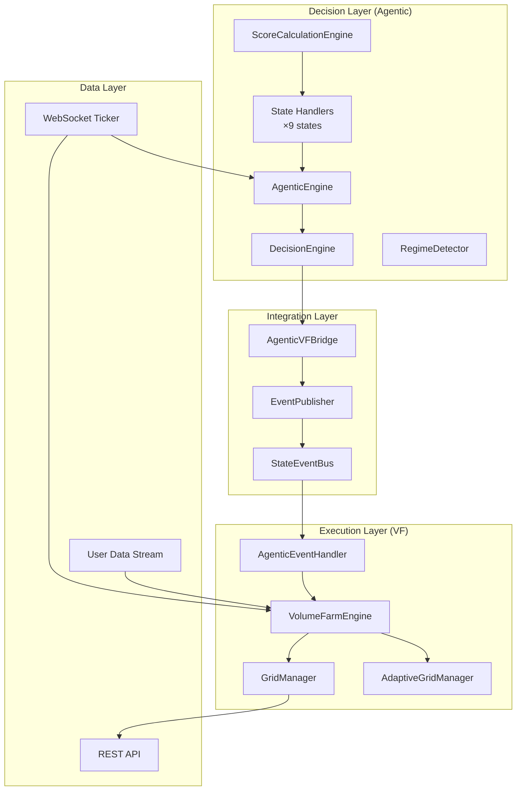
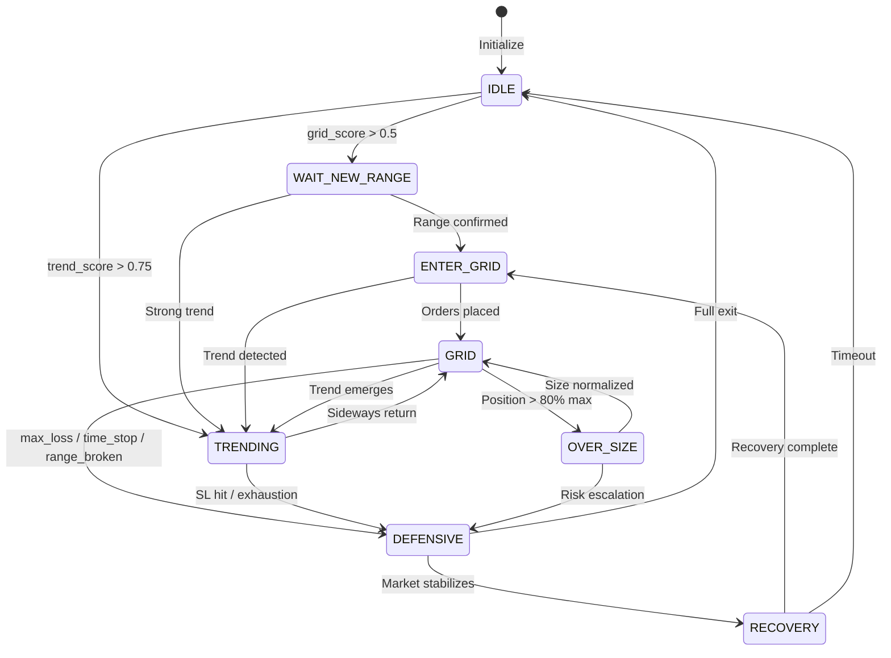
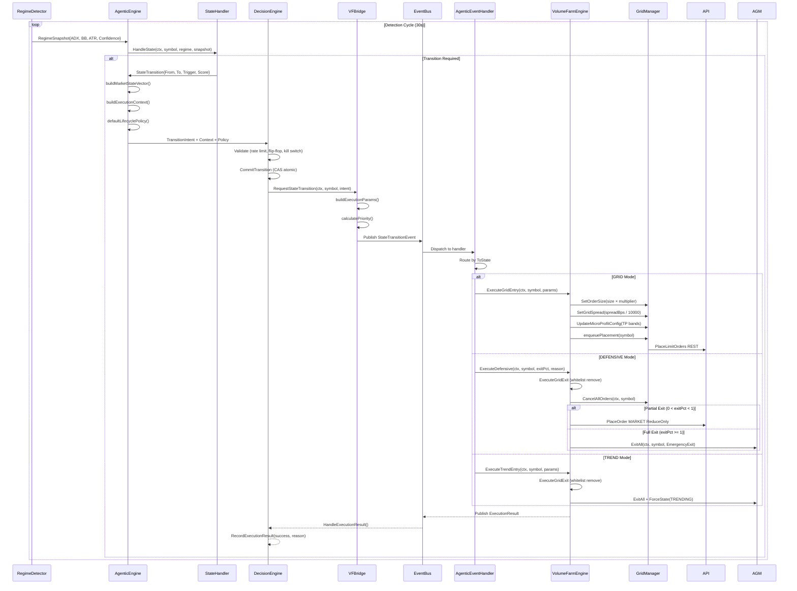

# AGENTIC TRADING - Technical Flow & Architecture (Updated 2026-04-22)

## 1. Tổng Quan Kiến Trúc (Hybrid Architecture v4.0)

**Kiến trúc 2 Layer:**



**Core Components:**
- **AgenticEngine**: Central decision coordinator
- **DecisionEngine**: Validates transitions, flip-flop prevention, rate limiting
- **StateEventBus**: Event-driven communication between layers
- **AgenticVFBridge**: Builds execution params from intent
- **AgenticEventHandler**: Subscribes to events, calls VF methods
- **VolumeFarmEngine**: Executes decisions (real order placement)

---

## 2. State Machine - 9 States



**State Timeouts:**
| State | Timeout | Action on Timeout |
|-------|---------|-------------------|
| ENTER_GRID | 2 min | → IDLE |
| GRID | 8 min | → DEFENSIVE (time_limit) |
| TRENDING (probe) | 30 min | → DEFENSIVE |
| TRENDING (follow) | 4 hours | → DEFENSIVE |
| OVER_SIZE | 15 min | → TRADING (forced) |
| DEFENSIVE | 20 min | → TRADING (forced) |
| RECOVERY | 10 min | → TRADING (forced) |

---

## 3. Decision Flow (Handler → DE → Bridge → VF)

### 3.1 Sequence Diagram



### 3.2 DecisionEngine Validation

| Check | Implementation | Fail Action |
|-------|----------------|-------------|
| Rate Limit | `MaxTransitionsPerMin` | Reject + log |
| Flip-Flop | Same transition < 5 min | Reject + increment counter |
| Hard Kill Switch | `AgenticV2.HardKillSwitch` | Reject all |
| Loss Cap | `RealizedPnL < -PerSymbolLossCapUSDT` | Force IDLE |
| State Consistency | `FromState != CurrentState` | Update FromState |

---

## 4. Execution Layer (VolumeFarm)

### 4.1 Execute Methods

| Method | Location | Real Orders | Logic |
|--------|----------|-------------|-------|
| `ExecuteGridEntry` | volume_farm_engine.go:2167 | ✅ Yes | Whitelist add, apply params, enqueue placement |
| `ExecuteDefensive` | volume_farm_engine.go:2362 | ✅ Yes | Whitelist remove, cancel, **partial/exit positions** |
| `ExecuteTrendEntry` | volume_farm_engine.go:2321 | ✅ Yes | Grid exit, force TRENDING state |
| `ExecuteTrendExit` | volume_farm_engine.go:2351 | ✅ Yes | Defensive 100% exit |
| `ExecuteAccumulation` | volume_farm_engine.go:2450 | ✅ Yes | 30% size grid entry |
| `ExecuteRecovery` | volume_farm_engine.go:2470 | ✅ Yes | 50% partial exit, RECOVERY state |
| `ExecuteIdle` | volume_farm_engine.go:2491 | ✅ Yes | 100% defensive exit |

### 4.2 ExecuteGridEntry - Params Applied

```go
func (e *VolumeFarmEngine) ExecuteGridEntry(ctx, symbol, params) {
    // 1. Whitelist management
    whitelist := e.symbolSelector.GetWhitelist()
    if !found { e.UpdateWhitelist(append(whitelist, symbol)) }
    
    // 2. Apply position size
    if params.PositionSizeMultiplier > 0 {
        e.gridManager.SetOrderSize(
            params.PositionSizeMultiplier × e.gridManager.GetBaseOrderSize()
        )
    }
    
    // 3. Apply grid spread
    if params.ExecutionContext.SpreadBps > 0 {
        spreadPct := params.ExecutionContext.SpreadBps / 10000.0
        e.gridManager.SetGridSpread(spreadPct)
    }
    
    // 4. Update micro-profit config with TP bands
    if len(params.TPBands) > 0 && e.gridManager.takeProfitMgr != nil {
        firstBand := params.TPBands[0]
        microProfitConfig := &adaptive_grid.MicroProfitConfig{
            Enabled:       true,
            SpreadPct:     firstBand.TargetBps / 10000.0,
            TimeoutSeconds: int(params.TimeStopSec),
            MinProfitUSDT: 0.01,
        }
        e.gridManager.takeProfitMgr.UpdateConfig(microProfitConfig)
    }
    
    // 5. Trigger placement
    e.gridManager.enqueuePlacement(symbol)
}
```

### 4.3 ExecuteDefensive - Partial Exit

```go
func (e *VolumeFarmEngine) ExecuteDefensive(ctx, symbol, exitPct, reason) {
    // 1. Remove from whitelist
    e.ExecuteGridExit(ctx, symbol, reason)
    
    // 2. Cancel orders
    e.gridManager.CancelAllOrders(ctx, symbol)
    
    // 3. Partial exit logic
    if exitPct > 0 && exitPct < 1.0 {
        positions := e.wsClient.GetCachedPositions()
        if pos, exists := positions[symbol]; exists && pos.PositionAmt != 0 {
            positionAmt := pos.PositionAmt
            reduceQty := math.Abs(positionAmt) × exitPct
            
            // Determine side (opposite of position)
            reduceSide := "SELL"
            if positionAmt < 0 { reduceSide = "BUY" }
            
            // Place MARKET order ReduceOnly
            orderReq := client.PlaceOrderRequest{
                Symbol:     symbol,
                Side:       reduceSide,
                Type:       "MARKET",
                Quantity:   fmt.Sprintf("%.6f", reduceQty),
                ReduceOnly: true,
            }
            e.futuresClient.PlaceOrder(ctx, orderReq)
        }
    }
    
    // 4. State transition
    e.adaptiveGridManager.GetStateMachine().ForceState(symbol, GridStateDefensive)
}
```

---

## 5. Lifecycle Policy (Execution Params)

### 5.1 Default Policy Build

```go
func (ae *AgenticEngine) defaultLifecyclePolicy(vector, snapshot) TradeLifecyclePolicy {
    targetAgeSec := int64(480)      // 8 minutes
    feeBudget := 8.0                // 8 bps
    minRangeQuality := 0.55
    
    // TP Bands (micro-profit)
    tpTarget := 12.0                // 12 bps = 0.12%
    return TradeLifecyclePolicy{
        TPBands: []TPBand{
            {TargetBps: tpTarget, CloseRatio: 0.5, MakerOnly: true},
            {TargetBps: tpTarget × 1.5, CloseRatio: 0.3, MakerOnly: true},
            {TargetBps: tpTarget × 2.0, CloseRatio: 0.2, MakerOnly: true},
        },
        SLPolicy: SLPolicy{
            SoftATRMultiplier: 1.6,
            HardLossBps:       28.0,    // 0.28%
            TimeStopSec:       480,     // 8 min
        },
        RegridPolicy: RegridPolicy{
            AllowImmediate:  vector.RangeQuality >= minRangeQuality,
            MinRangeQuality: minRangeQuality,
            FlattenFirst:    true,
        },
        MakerOnly:         true,
        MaxPositionAgeSec: targetAgeSec,  // 480s = 8 min
        FeeBudgetBps:      feeBudget,
    }
}
```

### 5.2 ExecutionParams Structure

```go
type ExecutionParams struct {
    // Grid-specific
    RangeLow, RangeHigh   float64
    GridLevels            int
    AsymmetricBias        string  // "long", "short", "neutral"
    
    // Trend-specific
    TrendDirection        string  // "up", "down"
    EntryPrice            float64
    StopLoss, TakeProfit  float64
    TrailingStop          bool
    
    // Defensive-specific
    ExitPercentage        float64 // 0.5 = 50% exit
    ExitReason            string
    
    // Position sizing
    PositionSizeMultiplier float64
    MaxPositionUSDT         float64
    
    // Lifecycle controls
    TPBands           []TPBand
    SLPolicy          SLPolicy
    TimeStopSec       int64
    MaxPositionAgeSec   int64
    RegridPolicy      RegridPolicy
    InventorySkew     float64
    MakerOnly         bool
    FeeBudgetBps      float64
    ExecutionContext  ExecutionContext
}
```

---

## 6. Circuit Breaker Wiring

### 6.1 Callbacks (Implemented in engine.go:200-224)

```go
// Set callback to trigger emergency exit when circuit breaker trips
engine.circuitBreaker.SetOnTripCallback(func(symbol, reason string) {
    engine.logger.Error("Circuit breaker tripped", zap.String("symbol", symbol))
    if err := vfController.TriggerEmergencyExit(reason); err != nil {
        engine.logger.Error("Failed to trigger emergency exit", zap.Error(err))
    }
})

// Set callback to trigger force placement when circuit breaker resets
engine.circuitBreaker.SetOnResetCallback(func(symbol string) {
    engine.logger.Info("Circuit breaker reset", zap.String("symbol", symbol))
    if err := vfController.TriggerForcePlacement(); err != nil {
        engine.logger.Error("Failed to trigger force placement", zap.Error(err))
    }
})
```

---

## 7. State Handlers

### 7.1 Handler Implementations

| Handler | File | Key Logic |
|---------|------|-----------|
| `IdleStateHandler` | idle_state.go | Grid/Trend score calc, score trend window |
| `WaitRangeStateHandler` | wait_range_state.go | Range detection, transition decisions |
| `EnterGridStateHandler` | enter_grid_state.go | Grid param calc, signal-triggered entry |
| `TradingGridStateHandler` | trading_grid_state.go | **Time-stop 8min**, rebalancing, risk checks |
| `TrendingStateHandler` | trending_state.go | Trailing stop, micro-TP, trend exhaustion |
| `DefensiveStateHandler` | defensive_state.go | Graduated exit (breakeven→half→all) |
| `RecoveryStateHandler` | recovery_state.go | Cooldown, param adjustment |
| `OverSizeStateHandler` | over_size_state.go | Position reduction tracking |
| `AccumulationStateHandler` | accumulation_state.go | Gradual position building |

### 7.2 TradingGridStateHandler - Key Params

```go
type TradingGridStateHandler struct {
    scoreEngine     *ScoreCalculationEngine
    maxGridLoss     float64  // -3%
    maxPositionSize float64  // 5%
    maxTimeInGrid   time.Duration  // 8 * time.Minute
}
```

---

## 8. Blocking Points (9 Points with Unblock)

| # | Point | Block | Unblock |
|---|-------|-------|---------|
| 1 | tradingPaused | Manual pause | `TryResumeTrading()` when range ready |
| 2 | cooldownActive | 3+ consecutive losses | Win recorded |
| 3 | RegridCooldown | Manual activation | Auto-expire or manual clear |
| 4 | RangeDetector | State = Breakout/Stabilizing | Auto-transition to Active |
| 5 | TimeFilter | Outside trading hours | Auto when time enters slot |
| 6 | RateLimiter | Token bucket empty | Auto refill |
| 7 | SpreadProtection | Spread > threshold | Auto when spread normalize |
| 8 | Position Limits | Notional > max | Gradual reduction |
| 9 | CircuitBreaker | Tripped | Auto-reset sau 3s evaluate |

---

## 9. KPIs & Performance Targets

| Metric | Target | Measurement |
|--------|--------|-------------|
| State Transition Latency | < 100μs | Handler → DE → Bridge → VF |
| Order Placement Latency | < 500ms | VF decision → Exchange ACK |
| Position Age (GRID) | 2-8 min | Time from entry to TP/SL/time-stop |
| Micro-Profit TP Hit | 0.5-0.8% | First TP band target |
| Win Rate (GRID) | 65-70% | Target for micro-profit farming |
| Detection Cycle | 30s | Regime detection interval |

---

## 10. File Structure

```
backend/
├── cmd/agentic/
│   └── main.go                    # Entry point, hybrid integration
├── internal/agentic/
│   ├── engine.go                  # AgenticEngine, runStateManagement
│   ├── decision_engine.go          # DecisionEngine, CommitTransition
│   ├── vf_bridge.go               # AgenticVFBridge, buildExecutionParams
│   ├── state_events.go            # StateTransitionEvent, ExecutionParams
│   ├── types.go                   # TradingMode, TransitionIntent
│   ├── *_state.go                 # 9 state handlers
│   └── circuit_breaker.go         # CircuitBreaker with callbacks
├── internal/farming/
│   ├── volume_farm_engine.go     # Execute* methods
│   ├── grid_manager.go            # Order placement, TP/SL
│   ├── agentic_event_handler.go   # Event subscription, VF routing
│   └── adaptive_grid/
│       ├── manager.go             # ExitAll, state forcing
│       ├── state_machine.go       # GridStateMachine
│       └── take_profit_manager.go # Micro-profit TP orders
```

---

*Version: 4.0*
*Updated: 2026-04-22*
*Architecture: Hybrid Agentic + VolumeFarm with 9-State Machine*
