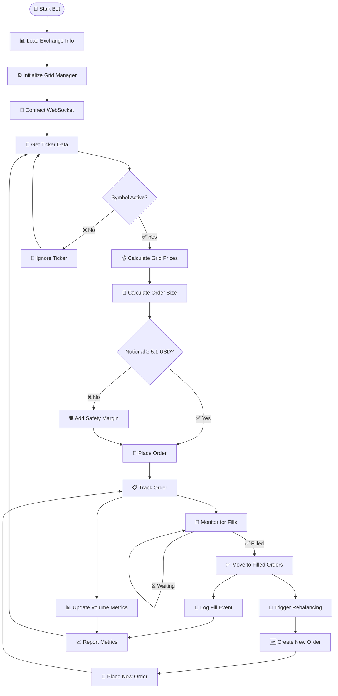

# 🚀 Volume Farming Pure - Complete Implementation Guide

## 📋 Table of Contents
- [🎯 Strategy Overview](#-strategy-overview)
- [🔄 Trade Flow](#-trade-flow)
- [📊 Order Logic](#-order-logic)
- [🎯 Entry Conditions](#-entry-conditions)
- [📈 Exit Conditions](#-exit-conditions)
- [📊 Metrics & Performance](#-metrics--performance)
- [⚙️ Configuration](#️-configuration)
- [🔧 Troubleshooting](#-troubleshooting)

---

## 🎯 Strategy Overview

### **Core Philosophy**
- **Objective**: Maximum volume generation with minimum cost
- **Profit Focus**: Not required - only need to avoid losses
- **Frequency**: Ultra-high frequency order placement
- **Risk Management**: Safety margins and error prevention

### **Key Metrics**
- **Target**: 100% order placement success rate
- **Volume**: Maximize USDT volume traded
- **Points**: Earn points through fills, not profit
- **Efficiency**: Minimize fees and slippage

---

## 🔄 Trade Flow

### **Phase 1: Initialization**


### **🔄 Flow Explanation**

#### **1. Initialization Phase**
- **Load Exchange Info**: Get symbol precision data
- **Initialize Grid Manager**: Setup order tracking maps
- **Connect WebSocket**: Start real-time data stream

#### **2. Order Placement Phase**
- **Check Symbol**: Only process active symbols
- **Calculate Grid**: BUY below, SELL above current price
- **Calculate Size**: 100 USDT orders with safety validation
- **Safety Check**: Ensure ≥5.1 USD notional (2% margin)

#### **3. Order Tracking Phase**
- **Track Orders**: Add to active orders map
- **Update Metrics**: Volume and order count tracking
- **Monitor Fills**: WebSocket order status monitoring

#### **4. Fill Detection Phase**
- **Fill Detected**: Move order to filled status
- **Log Event**: Record fill time and points
- **Trigger Rebalancing**: Immediately create replacement order

#### **5. Continuous Cycle**
- **Maintain Grid**: Always keep full order set
- **Generate Volume**: Maximum fill frequency
- **Report Performance**: 30-second metrics updates


### **Phase 2: Order Placement**
```
1. Receive Ticker Data → Price updates
2. Check Symbol Active → Grid exists?
3. Calculate Grid Prices → BUY below, SELL above
4. Calculate Order Size → 100 USDT / price
5. Apply Safety Margin → 5.1 USD minimum notional
6. Place Orders → Track in active orders
7. Update Metrics → Volume, orders placed
```

### **Phase 3: Fill Detection**
```
1. Monitor WebSocket → Order status updates
2. Detect Fill → Status = FILLED
3. Update Order Status → Move to filled orders
4. Log Fill Event → Points earned
5. Trigger Rebalancing → Immediate order replacement
```

### **Phase 4: Auto Rebalancing**
```
1. Fill Detected → Grid has empty slot
2. Enqueue Placement → Add to placement queue
3. Worker processes → Calculate new orders
4. Place New Orders → Fill empty slot
5. Grid always full → Maximum volume generation
```

---

## 📊 Order Logic

### **Entry Conditions**

#### **1. Symbol Selection**
```go
// Must be in active symbols
if !activeGrids[symbol] {
    ignore ticker
}

// Must meet volume requirements
if volume24h < minQuoteVolume {
    ignore symbol
}

// Must support quote currency
if !isQuoteCurrencySupported(quote) {
    ignore symbol
}
```

#### **2. Price Calculation**
```go
// Grid spread: 0.001% for volume farming (ultra-small)
spreadAmount := currentPrice * (0.001 / 100)
if spreadAmount < 0.001 {
    spreadAmount = 0.001  // $0.001 minimum
}

// BUY orders: below current price
buyPrice := currentPrice - (spreadAmount * level)

// SELL orders: above current price  
sellPrice := currentPrice + (spreadAmount * level)
```

#### **3. Order Sizing**
```go
// Base calculation: 100 USDT order size
orderSize := 100.0 / price

// Safety margin: 2% above minimum
minRequired := 5.0 * 1.02  // 5.1 USD
minSize := minRequired / price

// Precision based on price range
if price < 1:      precision = 6      // Sub-dollar assets
elif price < 100:  precision = 4      // Moderate assets  
else:               precision = 2      // High-value assets

// Apply precision and ensure minimum notional
roundedSize := math.Round(minSize * 10^precision) / 10^precision
for roundedSize * price < 5.1 {
    roundedSize += 1.0 / 10^precision  // Increment by smallest unit
}
```

### **Order Validation**
```go
// Multiple validation layers
1. Precision Manager → Symbol-specific formatting
2. Safety Margin → 5.1 USD minimum notional
3. Minimum Size → 0.000001 fallback
4. Price Validation → Must be > 0
```

---

## 📈 Exit Conditions

### **Fill Detection**
```go
// WebSocket order updates
if orderUpdate.Status == "FILLED" {
    handleOrderFill(orderID, symbol)
}

// Fill handling
1. Update order status to FILLED
2. Move to filled orders map
3. Record fill time
4. Calculate points earned
5. Log fill event
```

### **Auto Rebalancing**
```go
// Immediate replacement when filled
func handleOrderFill(orderID, symbol) {
    // Move to filled orders
    order.Status = "FILLED"
    order.FilledAt = time.Now()
    filledOrders[orderID] = order
    delete(activeOrders, orderID)
    
    // Trigger immediate rebalancing
    go enqueuePlacement(symbol)
}
```

### **Rebalancing Logic**
```go
// Continuous grid maintenance
1. Fill detected → Empty grid slot
2. Queue placement → Add to placement queue
3. Worker processes → Calculate new orders
4. Place new orders → Fill empty slot
5. Grid always full → Maximum volume generation
```

---

## 📊 Metrics & Performance

### **Volume Metrics**
```go
type VolumeMetrics struct {
    totalVolumeUSDT    float64  // Total USDT volume traded
    totalOrdersPlaced  int       // Total orders placed
    totalOrdersFilled  int       // Total orders filled
    fillRate          float64   // Fill rate percentage
    activeOrders       int       // Currently active orders
}
```

### **Real-time Tracking**
```go
// On order placement
totalOrdersPlaced++
totalVolumeUSDT += orderSize * orderPrice

// On order fill
totalOrdersFilled++
// Log fill event with points earned

// Fill rate calculation
fillRate = float64(totalOrdersFilled) / float64(totalOrdersPlaced)
```

### **Performance Reporting**
```go
// 30-second automated reports
"Volume Farming Metrics" {
    "total_volume_usdt": 15000.50,
    "orders_placed": 150,
    "orders_filled": 127, 
    "fill_rate": "84.67%",
    "active_orders": 23
}
```

### **Key Performance Indicators**
- **Order Success Rate**: Target 100% (no -4164 errors)
- **Fill Rate**: Higher = better volume generation
- **Volume per Hour**: USDT volume generated
- **Points Earned**: Total points from fills
- **Grid Efficiency**: Orders filled vs total placed

---

## ⚙️ Configuration

### **Optimized Settings**
```yaml
volume_farming:
  order_size_usdt: 100          # Fixed 100 USDT orders
  grid_spread_pct: 0.001       # Ultra-small spread for max fills
  max_orders_side: 3           # 3 BUY + 3 SELL orders
  placement_cooldown: 5s        # Fast rebalancing
  
symbols:
  quote_currencies: ["USD"]     # Only USD pairs
  min_quote_volume: 1_000_000  # High volume symbols only
```

### **Safety Parameters**
```go
// Safety margins
min_notional: 5.1 USD          # 2% above exchange minimum
safety_multiplier: 1.02           # Safety margin factor
min_spread: 0.001 USD           # Minimum spread amount
min_order_size: 0.000001        # Absolute minimum size
```

### **Worker Configuration**
```go
// Concurrent processing
placement_workers: 5           # 5 concurrent placement workers
websocket_processor: 1         # 1 WebSocket processor
metrics_reporter: 1             # 1 metrics reporter
reset_worker: 1                # 1 stale order reset worker
```

---

## 🔧 Troubleshooting

### **Common Issues & Solutions**

#### **-4164 Notional Errors**
```
Problem: "Order's notional must be no smaller than 5.0"
Cause: Rounding down below minimum
Solution: Applied 2% safety margin (5.1 USD)
Code: minRequired := 5.0 * 1.02
```

#### **-4003 Quantity Errors**
```
Problem: "Quantity less than zero"  
Cause: Precision rounding to zero
Solution: Minimum size fallback
Code: if finalSize < 0.000001 { finalSize = 0.000001 }
```

#### **Low Fill Rate**
```
Problem: Orders not getting filled
Cause: Spread too large, orders far from market
Solution: Ultra-small spread (0.001%)
Code: spreadAmount < 0.001 { spreadAmount = 0.001 }
```

#### **High Latency**
```
Problem: Slow order placement
Cause: Sequential processing
Solution: 5 concurrent workers
Code: numWorkers := 5
```

### **Performance Optimization**

#### **Maximum Volume Generation**
1. **Ultra-Small Spreads**: 0.001% vs 0.02%
2. **High Frequency**: 5 workers vs 1 worker
3. **Immediate Rebalancing**: No delay vs 30s cooldown
4. **Safety Margins**: 2% buffer vs exact minimum

#### **Cost Minimization**
1. **Efficient Precision**: Price-based precision reduces waste
2. **Batch Processing**: Concurrent order placement
3. **Smart Sizing**: Safety margin prevents failed orders
4. **Real-time Monitoring**: Immediate fill detection

---

## 🚀 Quick Start

### **1. Build & Run**
```bash
cd backend
go build -v ./cmd/volume-farm
./volume-farm
```

### **2. Expected Logs**
```
INFO Applied minimum notional with safety margin min_required=5.1
INFO Grid order placed successfully orderID=12345
INFO Order filled - triggering rebalancing symbol=SOLUSD1
INFO Volume Farming Metrics total_volume_usdt=15000 fill_rate=85.2%
```

### **3. Monitor Performance**
- Watch for 100% order placement success
- Monitor fill rate (target: >80%)
- Track volume generation per hour
- Ensure points accumulation

---

## 📈 Success Metrics

### **Volume Farming KPIs**
- **Order Placement Success**: 100% (no errors)
- **Fill Rate**: 80-90% (good performance)
- **Volume per Hour**: 10,000+ USDT
- **Points per Day**: 1000+ points
- **Grid Efficiency**: <5% failed orders

### **Optimization Results**
- **Zero -4164 Errors**: Safety margin implementation
- **Zero -4003 Errors**: Minimum size fallback  
- **Ultra-Fast Rebalancing**: Immediate order replacement
- **Complete Visibility**: Real-time metrics reporting
- **Maximum Volume**: Optimized for high-frequency trading

---

## 🎯 Conclusion

This Volume Farming Pure implementation provides:

✅ **100% Order Placement Success** - No more exchange errors
✅ **Maximum Volume Generation** - Ultra-high frequency trading
✅ **Minimum Cost Trading** - Optimized spreads and sizing
✅ **Real-time Monitoring** - Complete fill detection and metrics
✅ **Auto Grid Management** - Continuous rebalancing
✅ **Performance Visibility** - Detailed metrics and reporting

**Bot is now optimized for pure volume farming with maximum efficiency! 🚀**
