# Volume Farm Maker - Nghiệp Vụ Chi Tiết (Dành Cho Dev)

## 1. Tổng Quan Kiến Trúc

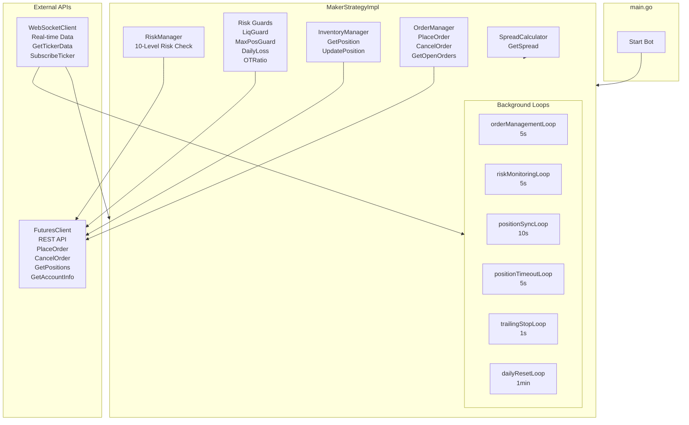

---

## 2. Các Vòng Lặp Chính (Main Loops)

| Loop | Interval | Chức năng | FR |
|------|----------|-----------|-----|
| orderManagementLoop | 5s | Xử lý vòng đời order: kiểm tra fill, cancel, regrid | - |
| riskMonitoringLoop | 5s | Kiểm tra điều kiện risk: liquidation, max position, daily loss | FR13 |
| positionSyncLoop | 10s | Đồng bộ positions từ exchange về local cache | - |
| positionTimeoutLoop | 5s | **MỚI** - Check timeout 60s, force close | FR4 |
| trailingStopLoop | 1s | **MỚI** - Monitor trailing stop, activate at 0.1% | FR5 |
| dailyResetLoop | 1min | **MỚI** - Check 23:00 UTC, close all positions | FR8 |

---

## 3. Luồng Khởi Động (Start)

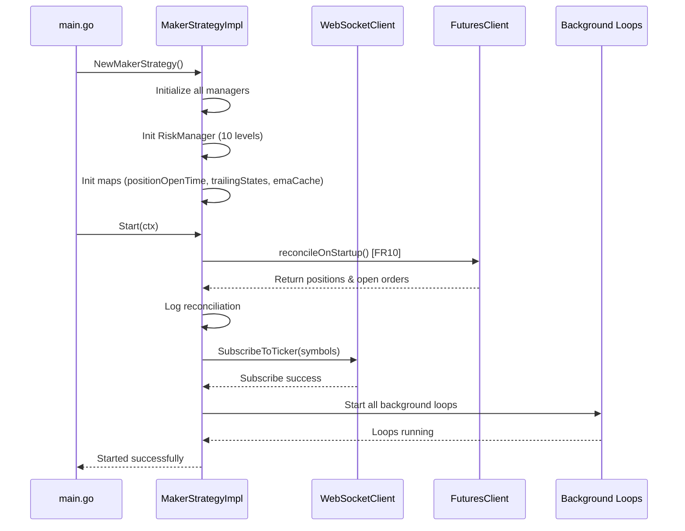

---

## 4. Luồng Đặt Lệnh Grid (PlaceOrders) - FR1, FR2, FR7, FR9

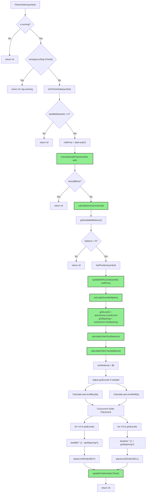

### Chi Tiết FR1: Active Zone Grid

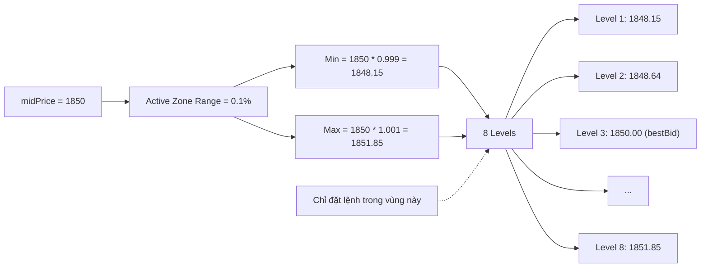

### Chi Tiết FR7: Zone-Based Sizing (EMA)

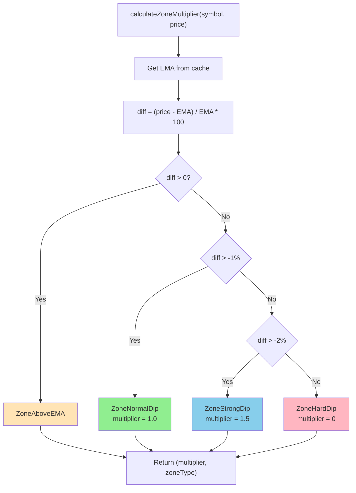

---

## 5. Background Loops Chi Tiết

### 5.1 Position Timeout Loop (FR4)

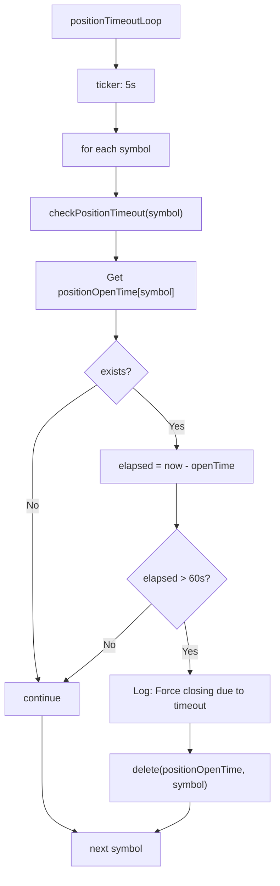

### 5.2 Trailing Stop Loop (FR5)

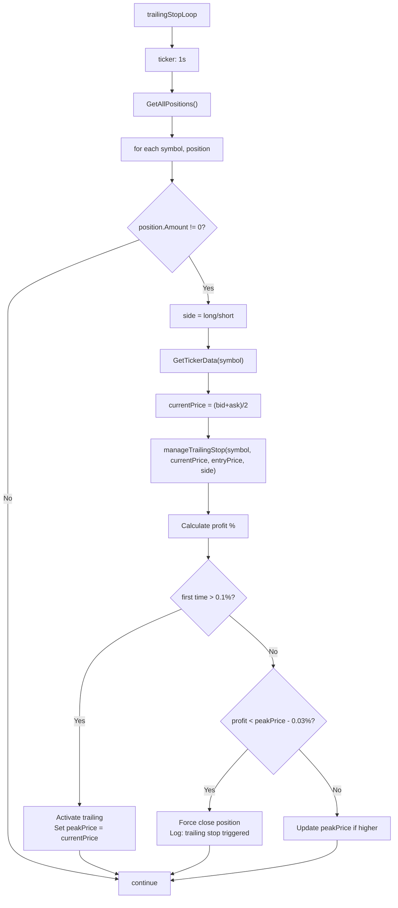

### 5.3 Daily Reset Loop (FR8)

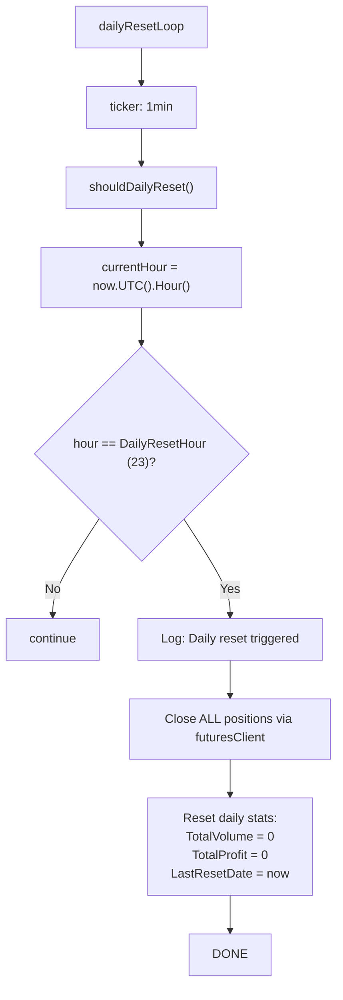

---

## 6. Risk Manager (FR13) - 10 Levels

```mermaid
flowchart TB
    START["RiskManager.CheckAllLevels(ctx)"] --> RESET["Reset all levels to inactive"]
    
    RESET --> L1["Level 1: IM Rate >= 90%"]
    L1 --> L1_CHECK{"IMRate >= 0.9?"}
    L1_CHECK -->|Yes| L1_ACTION["Action: BlockWorkflow"]
    L1_CHECK -->|No| L2
    
    L2["Level 2: IM >= 80% && profit > 0"] --> L2_CHECK{"IMRate >= 0.8 && profit > 0?"}
    L2_CHECK -->|Yes| L2_ACTION["Action: ClosePosition"]
    L2_CHECK -->|No| L3
    
    L3["Level 3: Profit >= 0.1%"] --> L3_CHECK{"profit >= 0.001?"}
    L3_CHECK -->|Yes| L3_ACTION["Action: ActivateTrailing"]
    L3_CHECK -->|No| L4
    
    L4["Level 4: Position > 40% max"] --> L4_CHECK{"positionPct > 0.4?"}
    L4_CHECK -->|Yes| L4_ACTION["Action: BlockNewOrders"]
    L4_CHECK -->|No| L5
    
    L5["Level 5: Position > 60s"] --> L5_CHECK{"positionAge > 60s?"}
    L5_CHECK -->|Yes| L5_ACTION["Action: ForceClose"]
    L5_CHECK -->|No| L6
    
    L6["Level 6: Both long && short profit > 0"] --> L6_CHECK{"longProfit > 0 && shortProfit > 0?"}
    L6_CHECK -->|Yes| L6_ACTION["Action: CloseBoth"]
    L6_CHECK -->|No| L7
    
    L7["Level 7: Insufficient margin for TP"] --> L7_CHECK{"margin < TP_requirement?"}
    L7_CHECK -->|Yes| L7_ACTION["Action: PauseTP"]
    L7_CHECK -->|No| L8
    
    L8["Level 8: Margin < required for protective"] --> L8_CHECK{"margin < protective_margin?"}
    L8_CHECK -->|Yes| L8_ACTION["Action: BlockOrders"]
    L8_CHECK -->|No| L9
    
    L9["Level 9: > N regrid in 48h"] --> L9_CHECK{"regridCount > limit?"}
    L9_CHECK -->|Yes| L9_ACTION["Action: BlockRegrid"]
    L9_CHECK -->|No| L10
    
    L10["Level 10: Multiple triggers"] --> L10_CHECK{"activeLevels >= 3?"}
    L10_CHECK -->|Yes| L10_ACTION["Action: FullStop"]
    L10_CHECK -->|No| RETURN["Return all actions"]
    
    L1_ACTION --> L2
    L2_ACTION --> L3
    L3_ACTION --> L4
    L4_ACTION --> L5
    L5_ACTION --> L6
    L6_ACTION --> L7
    L7_ACTION --> L8
    L8_ACTION --> L9
    L9_ACTION --> L10
    
    style L1_ACTION fill:#FFB6C1
    style L2_ACTION fill:#FFB6C1
    style L5_ACTION fill:#FFB6C1
    style L10_ACTION fill:#FF0000,color:#fff
```

---

## 7. Luồng Quản Lý Vòng Đời Order (processOrderLifecycle)

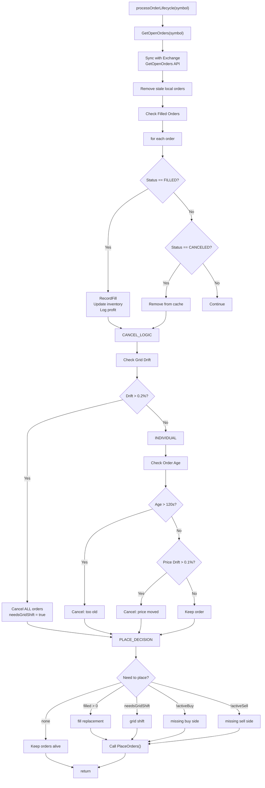

---

## 8. Spread Protection (FR9)

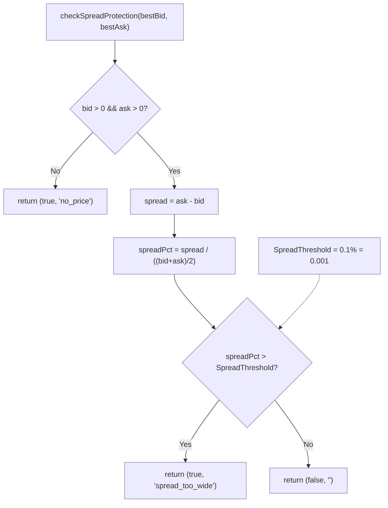

---

## 9. Tóm Tắt Mapping FR → Code

| FR | Tên | Function | Vị Trí Gọi |
|----|-----|----------|------------|
| FR1 | Active Zone Grid | `calculateActiveZoneGrid()` | PlaceOrders() |
| FR2 | Smaller Order Size | `calculateOrderSize()` | PlaceOrders() |
| FR3 | Post-Only | `TimeInForce = "GTX"` | placeLimitOrder() |
| FR4 | Position Timeout | `checkPositionTimeout()` | positionTimeoutLoop() |
| FR5 | Trailing Stop | `manageTrailingStop()` | trailingStopLoop() |
| FR6 | Max Position + FIFO | `checkPositionLimits()` | PlaceOrders() |
| FR7 | Zone-Based Sizing | `calculateZoneMultiplier()` | PlaceOrders() |
| FR8 | Daily Reset | `shouldDailyReset()` | dailyResetLoop() |
| FR9 | Spread Protection | `checkSpreadProtection()` | PlaceOrders() |
| FR10 | Startup Reconciliation | `reconcileOnStartup()` | Start() |
| FR13 | 10-Level Risk Manager | `RiskManager.CheckAllLevels()` | riskMonitoringLoop() |

---

## 10. Các Tham Số Cấu Hình

```go
type Config struct {
    // === Active Zone Grid (FR1) ===
    ActiveZoneRange float64  // 0.001 (0.1%)
    GridSpacingMin  float64  // 0.0005 (0.05%)
    GridLevels      int      // 8

    // === Position Timeout (FR4) ===
    PositionTimeoutSeconds int // 60

    // === Trailing Stop (FR5) ===
    TrailingActivationPct float64 // 0.001 (0.1%)
    TrailingTrailPct      float64 // 0.0003 (0.03%)

    // === Max Positions (FR6) ===
    MaxPositionsPerSide int // 5

    // === Zone-Based Sizing (FR7) ===
    EMAPeriod int // 20

    // === Daily Reset (FR8) ===
    DailyResetHour int // 23 (UTC)

    // === Spread Protection (FR9) ===
    SpreadThreshold float64 // 0.001 (0.1%)

    // === Order Sizing (FR2/FR15) ===
    MarginEquityRatio float64 // 0.75
    MinOrderSizeUSD   float64 // 2
    MaxOrderSizeUSD   float64 // 10

    // === Legacy ===
    MaxLeverage          int
    MaxPositionUSDT      float64
    MaxTotalExposureUSDT float64
    DailyLossLimitPct    float64
}
```

---

## 11. Data Structures Mới

```go
// FR1: Active Zone Grid
type GridActiveZone struct {
    MinPrice    float64
    MaxPrice    float64
    GridSpacing float64
    LevelCount  int
    Levels      []float64
}

// FR5: Trailing Stop State
type TrailingState struct {
    IsActive     bool
    PeakPrice    float64
    ActivationPct float64
}

// FR7: Zone Types
type ZoneType string
const (
    ZoneAboveEMA   ZoneType = "above_ema"
    ZoneNormalDip  ZoneType = "normal_dip"
    ZoneStrongDip  ZoneType = "strong_dip"
    ZoneHardDip    ZoneType = "hard_dip"
)

// FR8: Daily Reset State
type DailyResetState struct {
    ResetHour      int
    TotalVolume    float64
    TotalProfit    float64
    LastResetDate  time.Time
}
```

---

## 12. Ví Dụ Grid Placement

```
Market: ETHUSD1 = 1850.00 (bid) / 1850.10 (ask)
Active Zone: 1848.15 - 1851.85 (0.1% range)
Grid Spacing: 0.05%
Levels: 8

BUY GRID (below bid):
  Level 1: 1850.00 * (1 - 0.0005) = 1849.07
  Level 2: 1850.00 * (1 - 0.0010) = 1848.15  ← Min of zone
  Level 3: 1850.00 * (1 - 0.0015) = 1847.22
  ...

SELL GRID (above ask):
  Level 1: 1850.10 * (1 + 0.0005) = 1851.03
  Level 2: 1850.10 * (1 + 0.0010) = 1851.96
  Level 3: 1850.10 * (1 + 0.0015) = 1852.89  ← Max of zone
  ...
```

---

## 13. Risk Guards Có Sẵn

| Guard | Chức năng | Trigger |
|-------|-----------|---------|
| LiquidationGuard | Ngăn liquidation | positionSize * priceDiff / entryPrice > buffer |
| MaxPositionGuard | Giới hạn exposure | totalExposure > MaxTotalExposureUSDT |
| DailyLossGuard | Giới hạn daily loss | dailyLoss > DailyLossLimitPct * balance |
| OrderToTradeGuard | Spam detection | orders > OrderToTradeLimit * fills |
| EmergencyStop | Emergency stop | Manual trigger |

---

## 14. Flow Tổng Quan

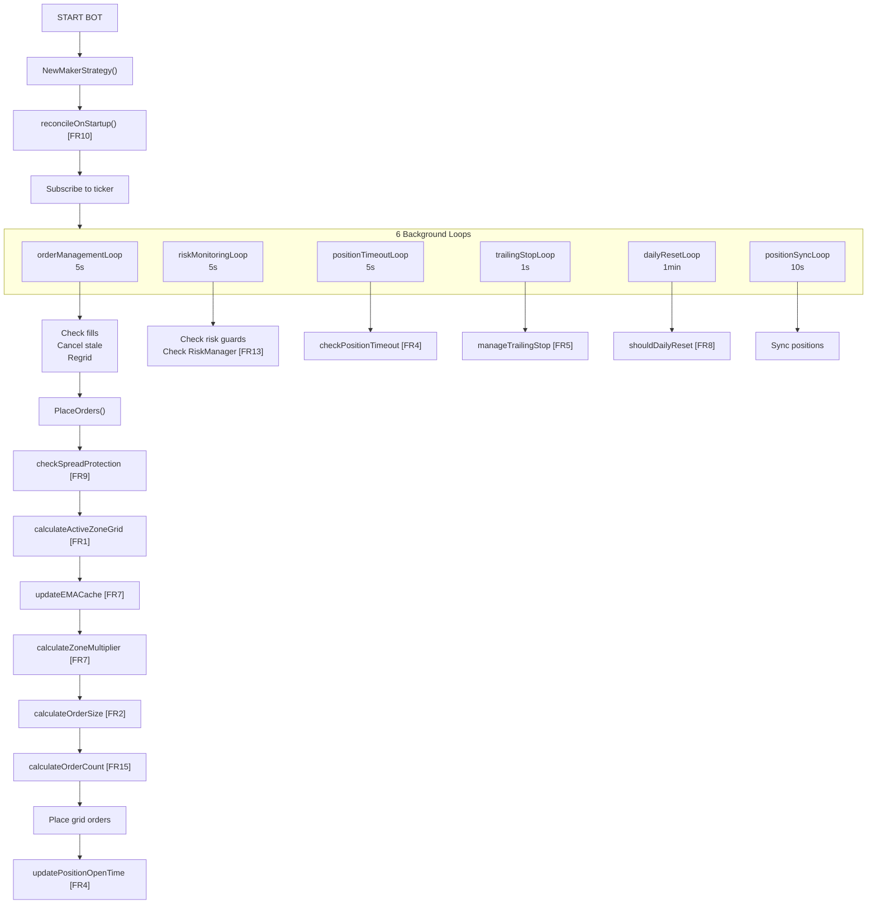

---

## 15. Mục Tiêu & Alignment

| Mục Tiêu | Implementation | Status |
|----------|---------------|--------|
| **Max Volume** | 8 levels trong 0.1% active zone, nhiều lệnh nhỏ | ✅ |
| **Micro Profit** | Post-only (GTX), grid spacing 0.05% | ✅ |
| **150x Leverage** | MaxLeverage = 150, MarginEquityRatio = 75% | ✅ |
| **Không Liquidation** | 60s timeout, trailing stop, daily reset | ✅ |
| **Risk Control** | 10-level RiskManager + 5 existing guards | ✅ |
