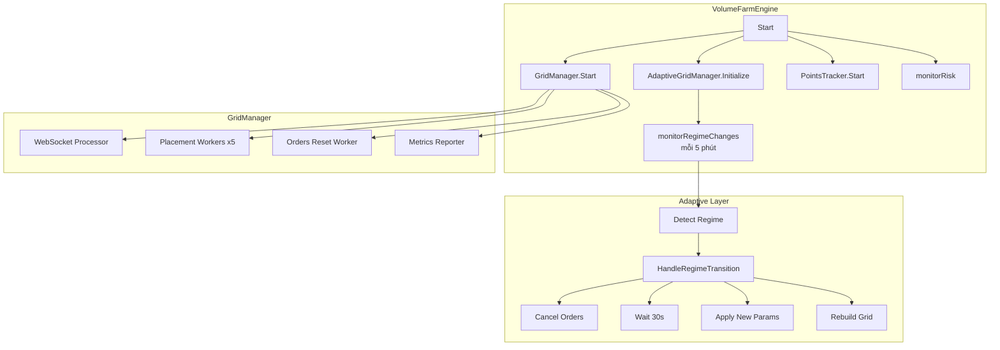
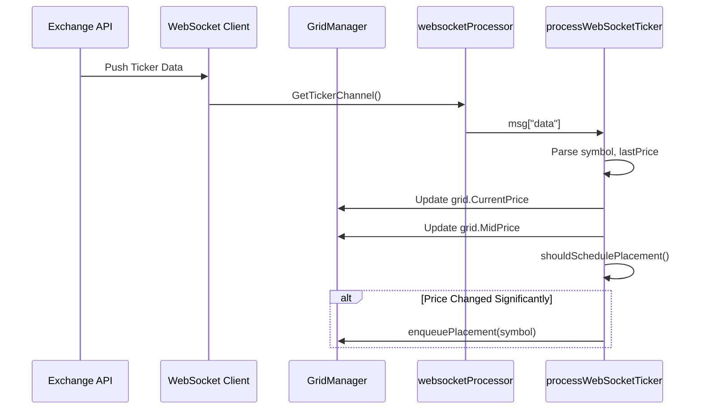
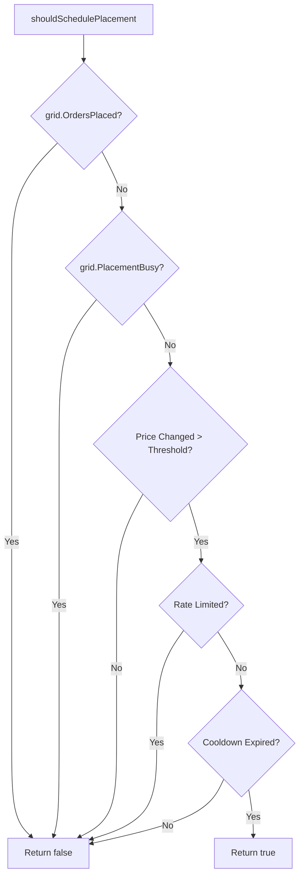
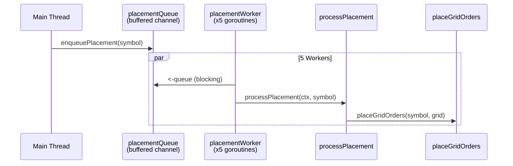
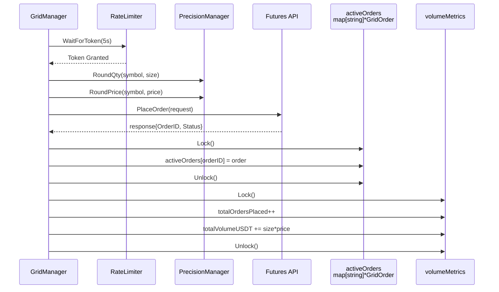
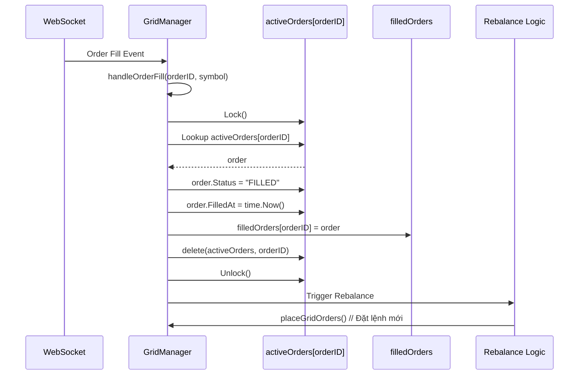
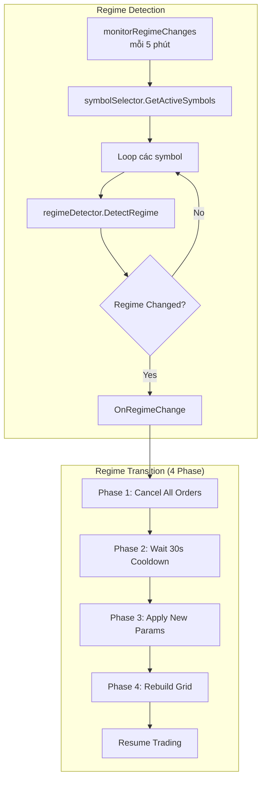
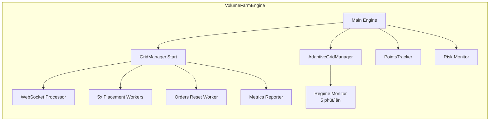
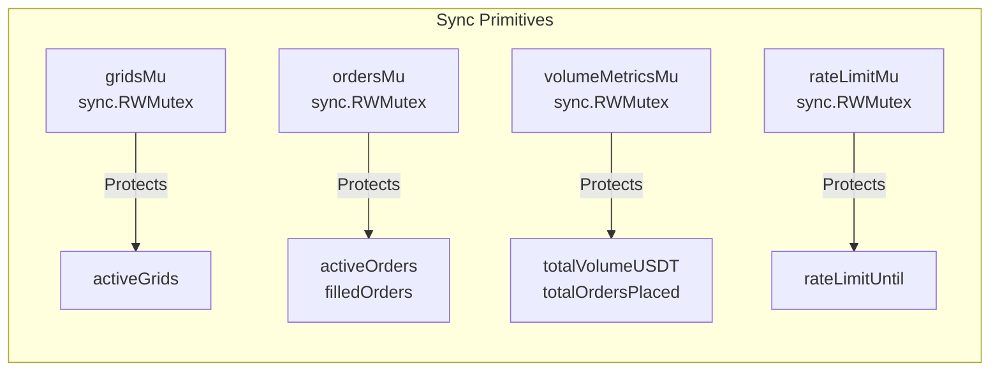

# Adaptive Grid Bot - Flow Vào Lệnh & Chờ Lệnh

> Tài liệu này giải thích chi tiết logic vào lệnh, chờ lệnh, và quản lý vị thế trong Adaptive Grid Trading Bot.

## 📊 Tổng Quan Kiến Trúc



---

## 🔄 Flow Chi Tiết: Từ Giá Đến Lệnh

### 1. Nhận Giá Real-time (WebSocket)



**Logic chi tiết** (`grid_manager.go:230-299`):
```go
func (g *GridManager) processWebSocketTicker(msg map[string]interface{}) {
    // 1. Parse ticker data từ WebSocket
    data := msg["data"].([]interface{})
    
    for _, item := range data {
        ticker := item.(map[string]interface{})
        symbol := ticker["s"].(string)
        lastPrice := strconv.ParseFloat(ticker["c"].(string), 64)
        
        // 2. Update giá trong grid
        oldPrice := grid.CurrentPrice
        grid.CurrentPrice = lastPrice
        grid.MidPrice = lastPrice
        grid.LastUpdate = time.Now()
        
        // 3. Kiểm tra có nên đặt lệnh mới
        if g.shouldSchedulePlacement(grid, oldPrice) {
            grid.PlacementBusy = true
            g.enqueuePlacement(symbol)  // Đưa vào queue
        }
    }
}
```

### 2. Kiểm Tra Điều Kiện Vào Lệnh



**Điều kiện vào lệnh** (`grid_manager.go:300-320`):
1. `OrdersPlaced == false` - Chưa có lệnh nào cho grid này
2. `PlacementBusy == false` - Không đang trong quá trình đặt lệnh
3. `|newPrice - oldPrice| / oldPrice > threshold` - Giá thay đổi đủ nhiều
4. `rateLimiter.WaitForToken()` - Có token trong rate limiter
5. `time.Since(grid.LastAttempt) > cooldown` - Đã qua thời gian cooldown

### 3. Queue & Worker Xử Lý Lệnh



**Worker Pool Pattern** (`grid_manager.go:201-206`):
```go
// Khởi động 5 workers đồng thời
numWorkers := 5
for i := 0; i < numWorkers; i++ {
    go g.placementWorker(ctx)
}

// Mỗi worker chạy vòng lặp vô hạn
func (g *GridManager) placementWorker(ctx context.Context) {
    for {
        select {
        case symbol := <-g.placementQueue:  // Blocking receive
            g.processPlacement(ctx, symbol)
        case <-ctx.Done():
            return
        }
    }
}
```

### 4. Tính Toán & Đặt Lệnh Grid

```mermaid
flowchart LR
    A[placeGridOrders] --> B[Calculate MidPrice]
    B --> C[Calculate Buy Prices<br/>mid * (1 - spread)]
    B --> D[Calculate Sell Prices<br/>mid * (1 + spread)]
    C --> E[Loop i=1 to MaxOrdersSide]
    D --> E
    E --> F{Rate Limiter<br/>Allow?}
    F -->|No| G[Skip Level]
    F -->|Yes| H[placeOrder]
    H --> I[Update activeOrders]
    I --> J[Update volume metrics]
```

**Logic đặt lưới lệnh** (`grid_manager.go:540-624`):
```go
func (g *GridManager) placeGridOrders(symbol string, grid *SymbolGrid) int {
    midPrice := grid.MidPrice
    placedOrders := 0
    
    // === BUY ORDERS ===
    for i := 1; i <= grid.MaxOrdersSide; i++ {
        buyPrice := midPrice * (1 - grid.GridSpreadPct*float64(i))
        
        order := &GridOrder{
            Symbol:    symbol,
            Side:      "BUY",
            Price:     buyPrice,
            Size:      g.orderSizeUSDT / buyPrice,
            GridLevel: i,
        }
        
        if err := g.placeOrder(order); err == nil {
            placedOrders++
        }
    }
    
    // === SELL ORDERS ===
    for i := 1; i <= grid.MaxOrdersSide; i++ {
        sellPrice := midPrice * (1 + grid.GridSpreadPct*float64(i))
        
        order := &GridOrder{
            Symbol:    symbol,
            Side:      "SELL", 
            Price:     sellPrice,
            Size:      g.orderSizeUSDT / sellPrice,
            GridLevel: i,
        }
        
        if err := g.placeOrder(order); err == nil {
            placedOrders++
        }
    }
    
    return placedOrders
}
```

### 5. Gọi API & Tracking



**Chi tiết placeOrder** (`grid_manager.go:627-684`):
```go
func (g *GridManager) placeOrder(order *GridOrder) error {
    // 1. Rate limiting - đợi token
    if !g.rateLimiter.WaitForToken(5 * time.Second) {
        return fmt.Errorf("rate limiter timeout")
    }
    
    // 2. Round số lượng và giá theo precision của symbol
    orderReq := &client.PlaceOrderRequest{
        Symbol:      order.Symbol,
        Side:        order.Side,
        Quantity:    g.precisionMgr.RoundQty(order.Symbol, order.Size),
        Price:       g.precisionMgr.RoundPrice(order.Symbol, order.Price),
        TimeInForce: "GTC",  // Good Till Cancelled
    }
    
    // 3. Gọi API
    response, err := g.futuresClient.PlaceOrder(context.Background(), *orderReq)
    if err != nil {
        g.handlePlaceOrderError(err)
        return err
    }
    
    // 4. Cập nhật tracking
    order.OrderID = fmt.Sprintf("%d", response.OrderID)
    order.Status = response.Status
    
    g.ordersMu.Lock()
    g.activeOrders[order.OrderID] = order
    g.ordersMu.Unlock()
    
    // 5. Update metrics
    g.volumeMetricsMu.Lock()
    g.totalOrdersPlaced++
    g.totalVolumeUSDT += order.Size * order.Price
    g.volumeMetricsMu.Unlock()
    
    return nil
}
```

---

## 🔄 Flow Xử Lý Lệnh Được Khớp (Order Fill)



---

## 🎯 Flow Chuyển Đổi Chế Độ Thị Trường (Adaptive)



**Chi tiết HandleRegimeTransition** (`adaptive_grid/manager.go:145-186`):
```go
func (a *AdaptiveGridManager) HandleRegimeTransition(
    ctx context.Context,
    symbol string,
    oldRegime, newRegime market_regime.MarketRegime,
) error {
    // Phase 1: Cancel existing orders
    if err := a.gridManager.CancelAllOrders(ctx, symbol); err != nil {
        return err
    }
    
    // Phase 2: Wait for transition period
    timer := time.NewTimer(30 * time.Second)
    <-timer.C  // Cooldown để tránh whipsaw
    
    // Phase 3: Apply new regime parameters
    if err := a.applyNewRegimeParameters(ctx, symbol, newRegime); err != nil {
        return err
    }
    
    // Phase 4: Rebuild grid with new parameters
    if err := a.gridManager.RebuildGrid(ctx, symbol); err != nil {
        return err
    }
    
    return nil
}
```

---

## 📋 Các Goroutines Chạy Song Song



| Goroutine | Chức Năng | Tần Suất |
|-----------|-----------|----------|
| WebSocket Processor | Nhận giá real-time | Liên tục |
| Placement Workers (x5) | Xử lý đặt lệnh từ queue | Khi có symbol trong queue |
| Orders Reset Worker | Reset stale orders | Theo cấu hình |
| Metrics Reporter | Log volume metrics | 30 giây |
| Regime Monitor | Phát hiện chế độ thị trường | 5 phút |
| Risk Monitor | Giám sát rủi ro | Liên tục |

---

## 🔒 Thread Safety (Mutex)



**Pattern sử dụng**:
```go
// Read - RLock
func (g *GridManager) GetActivePositions(symbol string) ([]interface{}, error) {
    g.ordersMu.RLock()         // Read Lock
    defer g.ordersMu.RUnlock()
    // ... đọc dữ liệu
}

// Write - Lock
func (g *GridManager) placeOrder(order *GridOrder) error {
    g.ordersMu.Lock()          // Write Lock
    defer g.ordersMu.Unlock()
    g.activeOrders[orderID] = order
}
```

---

## 📁 File Structure

```
backend/internal/farming/
├── grid_manager.go              # Core grid logic (1079 lines)
├── volume_farm_engine.go        # Main engine orchestration
├── adaptive_grid/
│   ├── manager.go               # Adaptive grid with regime detection
│   ├── order_manager.go         # Order lifecycle management
│   ├── parameter_applier.go     # Regime-specific params
│   └── transition_handler.go    # Smooth transitions (merged)
├── adaptive_config/
│   ├── manager.go               # Config management
│   ├── regime_configs.go        # Trending/Ranging/Volatile configs
│   ├── reloader.go             # Hot-reload functionality
│   └── validator.go            # Param validation
└── market_regime/
    ├── detector.go              # Regime detection logic
    ├── momentum.go              # Momentum calculation
    ├── atr.go                   # ATR volatility
    └── hybrid.go                # Hybrid detection algorithm
```

---

## ⚙️ Cấu Hình Key

| Param | Mô tả | Giá trị mặc định |
|-------|-------|-----------------|
| `orderSizeUSDT` | Kích thước mỗi lệnh | 10 USDT |
| `gridSpreadPct` | Khoảng cách giữa các lệnh | 0.1% |
| `maxOrdersSide` | Số lệnh tối đa mỗi bên | 5 |
| `placementWorkers` | Số worker xử lý lệnh | 5 |
| `transitionCooldown` | Thời gian chờ chuyển regime | 30 giây |
| `regimeCheckInterval` | Tần suất kiểm tra regime | 5 phút |

---

## 📝 Tóm Tắt

1. **Nhận giá**: WebSocket → processWebSocketTicker
2. **Quyết định**: shouldSchedulePlacement kiểm tra điều kiện
3. **Queue**: enqueuePlacement đưa symbol vào channel
4. **Worker**: 5 placementWorker xử lý song song
5. **Tính toán**: placeGridOrders tạo lưới buy/sell
6. **Gọi API**: placeOrder gọi Futures API với rate limiting
7. **Tracking**: activeOrders map theo dõi trạng thái
8. **Fill handling**: WebSocket fill event → handleOrderFill
9. **Adaptive**: Mỗi 5 phút kiểm tra regime, chuyển đổi mượt mà

**Tất cả operations đều thread-safe với RWMutex!**
